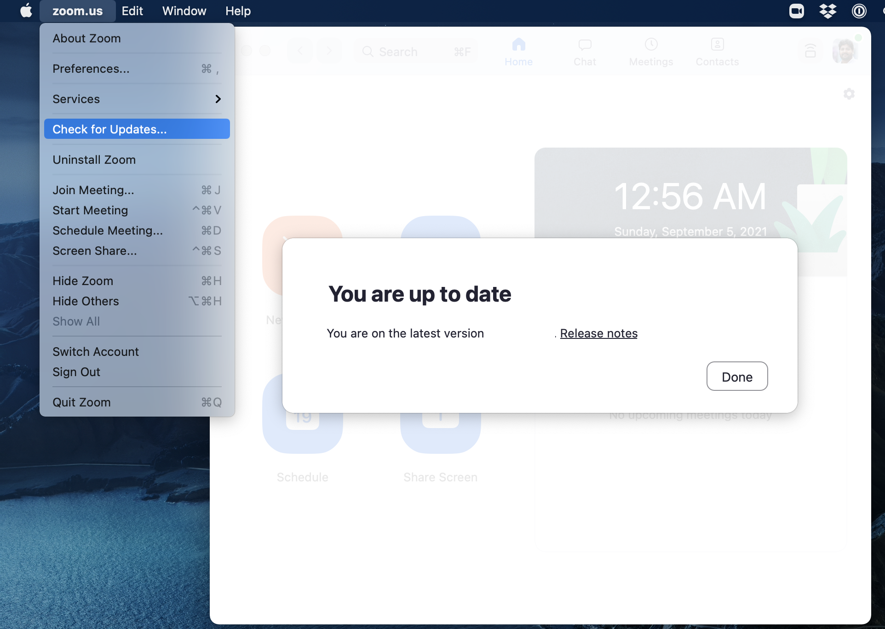
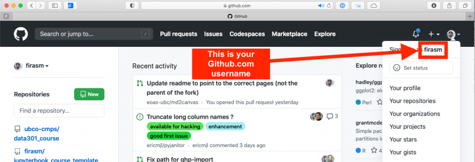

(general_install)=
General Installation Instructions
=======================

<!-- Open links in a new tab unless they have the `` attribute -->
<head>
    <base target="_blank">
</head>

As you go through this install guides, remember that perhaps the two most important things you will learn in this course is how to troubleshoot things and achieve familiarity and proficiency with your computer.
Be patient, read things carefully, do not be afraid to try things, it's unlikely you will do anything to irreversibly break your computer! 
Almost everything you do (you're on your own if you decide to take a hammer to your laptop!) can be undone, don't be afraid to ask your peers, TAs, and the instructor on {{ FORUM_LINK }}.

This is an exciting time for you as you begin your journey!

## Install the Stack

These instructions will walk you through installing the required Computer Science software stack for {{ COURSE_CODE }}. 
Before starting, ensure that your laptop meets the minimum system requirements:

- runs one of the following operating systems: 
    - Macs: 
        - Minimum Required: macOS 10.11 (El Capitan)
        - Recommended: macOS 10.14.6 or higher
        - Latest: macOS 12.5.1
    - Windows: 
        - Minimum Required: Windows 7 or higher
        - Recommended: Windows 10 (64-bit) or higher
        - Latest: Windows 11
    - Ubuntu: 
        - Minimum Required: version 18.04
        - Recommended: Ubuntu 20.04 or higher
        - Latest: Ubuntu 22.04
- can connect to networks via a wireless connection
- has at least 25 GB disk space available
- has at least 4 GB of RAM
- uses English as the default language (if you want TAs or the instructor to help you)
- student user has full administrative access to the computer

**We will do our best to help you if your laptop does not meet the minimum requirements, but there are no guarantees we will be able to get things to work so be warned.**

## Web browser

You are welcome to use most modern browsers that have a WebKit or Gecko backend.
[Safari](https://www.apple.com/ca/safari/), [Firefox](https://www.mozilla.org/en-CA/firefox/new/?redirect_source=firefox-com), [Vivaldi](https://vivaldi.com), [Brave](https://brave.com), [Edge](https://www.microsoft.com/en-us/edge) are all recommended.
Google Chrome is not recommended because of the [well-documented privacy and tracking issues with Google](https://www.forbes.com/sites/zakdoffman/2021/03/20/stop-using-google-chrome-on-apple-iphone-12-pro-max-ipad-and-macbook-pro/).

## UBC Student Email

As a student of UBC you are entitled to a free, secure, institutional email address: **<your_cwl>@student.ubc.ca**.
But, to claim it, you must first activate it.

Here are the steps to sign up for a Student Email Address:

- Sign in to the [CWL myAccount page](https://www.myaccount.ubc.ca/myAccount/login.xhtml) and click on **Activate Student Email**
    - You must be registered in a course and in good standing to be eligible for this service
- Check your [UBC Student Email online](https://webmail.student.ubc.ca/)
- Set up your UBC email on your mobile device
    - [iOS](https://ubc.service-now.com/kb_view.do?sysparm_article=KB0016885)
    - [Android](https://ubc.service-now.com/kb_view.do?sysparm_article=KB0016889)
- Set up your UBC email on your laptop or desktop to send/receive email
    - macOS
        - Open the "Mail" app on your macOS
            - If you've never linked an email account before, it will ask you to add an Account
            - If you already have a different account added to your Mail app (for e.g., your gmail account), click on Mail on the top menubar and click "Add Account"
        - Choose "Microsoft Exchange" as the account option
        - Enter in your email address: <your_cwl>@student.ubc.ca
        - Enter in your password at the prompt, and it should authenticate
    - [Windows](https://ubc.service-now.com/kb_view.do?sysparm_article=KB0016884)

You should get into the habit of using this email address as much as possible during your career at UBC.
This account will also grant you access to a range of other UBC services including a free license to Microsoft Office and OneDrive.

## Microsoft Office

UBC students have free access to a Microsoft Office 365 annual subscription, which is renewed for students enrolled in at least one course.
Office 365 includes Word, Excel, PowerPoint, Outlook, and OneNote, and is available on a variety of platforms.

To get your free Office 365 license and download the installer files, visit [UBC IT](https://it.ubc.ca/services/desktop-print-services/software-licensing/office-365-students) for the installation instructions.
Note that you will need your CWL login credentials in order to download the software and activate your license from [portal.office.com](https://portal.office.com).

In this course, you will need Microsoft Word, Microsoft PowerPoint, and Microsoft Excel.

```{important}
You may be wondering why we are asking you to use the Microsoft Office productivity suite when there are plenty of other options available like LibreOffice, Apple Pages/Numbers/Keynote, and the one you're all probably familiar with: Google Docs.
Well, rest assured that Microsoft is *not* paying me for this! 

I have made the deliberate decision **not** to teach with Google Docs because I have significant concerns about Google's general business model (which monetizes its users in shady and borderline unethical ways, unbeknownst to the users).
It's unlikely that Google is (currently) directly monetizing your content in Google Docs, but they are definitely tracking you and how you use their products.

My personal preference is to use Keynote and Pages, but I know that this software is not available to students on Windows and Linux.
It just so happens that the Microsoft Office suite is the highest quality, most privacy-focused product available to **all UBC students for free**.

In this course, you will be required to use Microsoft Word/PowerPoint/Excel - but luckily, once you learn this suite, you should be ready to use all other alternatives with relative ease.
```

## Zoom

You will likely need the Zoom application in this course for student hours with the TAs.

```{important}
Please note that if you have been relying on the "web version" of Zoom that works only in a browser, this will not work for this course! Please make sure to download the Zoom desktop client for your operating system to fully participate in the course.
```

The latest version of Zoom as of Sept 2022 is: `5.11.10 (102279)`. 
You can ensure you have the latest version of Zoom by clicking "Check for Updates" as shown in the screenshot below.



## GitHub.com account

Sign up for a free account at [GitHub.com](https://github.com/) if you don't have one already.
Your GitHub username is important, here's how to find your username:



## That's it!

You have completed the installation instructions, well done 🙌!