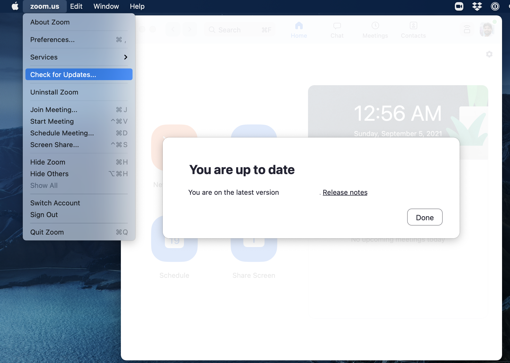
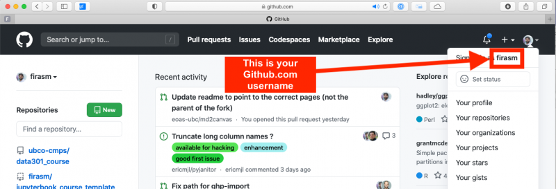
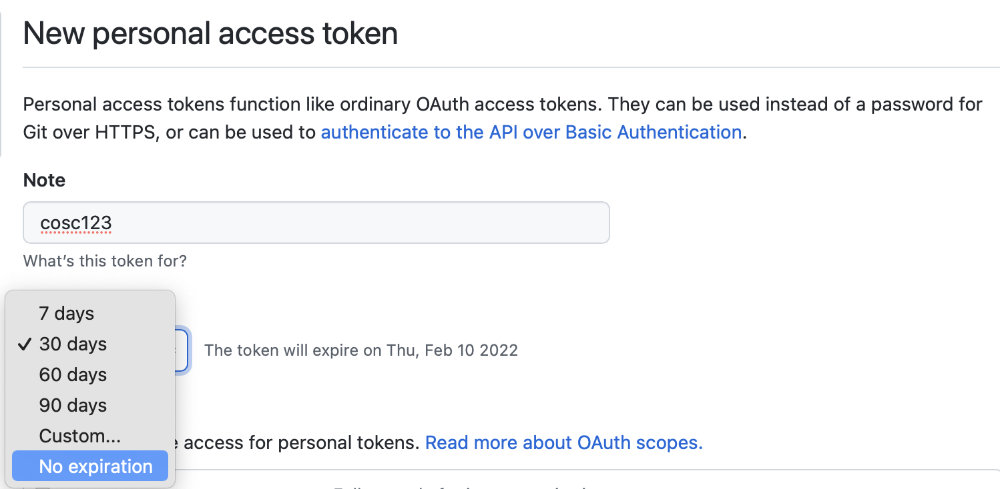

(page_install_ds_stack_macOS)=
macOS Install Instructions
=======================

<!-- Open links in a new tab unless they have the `` attribute -->
<head>
    <base target="_blank">
</head>

These instructions will walk you through installing the required Computer Science software stack for {{ COURSE_CODE }}. 
Before starting, ensure that your laptop meets the minimum requirements:

- runs one of the following operating systems: 
    - Macs: 
        - Latest: macOS 12.1
        - Recommended: macOS 10.14.6 or higher
        - Required: macOS 10.11 (El Capitan)
    - Windows: 
        - Latest: Windows 11
        - Recommended: Windows 10 (64-bit) or higher
        - Required: Windows 7 or higher
    - Ubuntu: 
        - Latest: Ubuntu 21.10
        - Recommended: Ubuntu 20.04 or higher
        - Required: version 18.04
- can connect to networks via a wireless connection
- has at least 25 GB disk space available
- has at least 4 GB of RAM
- uses English as the default language (if you want TAs or the instructor to help you)
- student user has full administrative access to the computer

**We will do our best to help you if your laptop does not meet the minimum requirements, but there are no guarantees we will be able to get things to work so be warned.**

## Web browser

You are welcome to use most modern browsers that have a WebKit or Gecko backend.
[Safari](https://www.apple.com/ca/safari/), [Firefox](https://www.mozilla.org/en-CA/firefox/new/?redirect_source=firefox-com), [Vivaldi](https://vivaldi.com), [Brave](https://brave.com), [Edge](https://www.microsoft.com/en-us/edge) are all recommended.
Google Chrome is not recommended because of the [well-documented privacy and tracking issues with Google](https://www.forbes.com/sites/zakdoffman/2021/03/20/stop-using-google-chrome-on-apple-iphone-12-pro-max-ipad-and-macbook-pro/).

## Zoom

We will be using Zoom in this course for the classes, as well as the labs, and student hours.
It is *very* important that you have the most recent version of Zoom installed, as we will be using many of the features that are only available in more recent versions.

The latest version of Zoom as of January 2022 is: `5.9.1 (3506)`.
You can ensure you have the latest version of Zoom by clicking "Check for Updates" as shown in the screenshot below.



```{important}
Please note that if you have been relying on the "web version" of Zoom that works only in a browser, this will not work for this course! Please make sure to download the Zoom desktop client for your operating system to fully participate in the course.
```

## GitHub.com account

Sign up for a free account at [GitHub.com](https://github.com/) if you don't have one already.
Your GitHub username is important, here's how to find your username:



## Visual Studio Code

The open-source text editor Visual Studio Code (VS Code) is both a powerful text editor and a full-blown Integrated Development Environment (IDE).
You can download and install the macOS version of VS Code from the VS code website [https://code.visualstudio.com/download](https://code.visualstudio.com/download).
Once the download is finished, click "Open with Archive utility", and move the extracted VS Code application from "Downloads" to "Applications".

### Configure your machine to launch VS Code from the Terminal (aka command line)

1. Launch VS Code.
2. Open the Command Palette (⇧⌘P ; shift+command+P).
3. Type 'shell command' to find the "Shell Command: Install 'code' command in PATH" command.
4. Hit Enter
5. Restart the terminal for the new $PATH value to take effect. 

You can open files in VS Code from the Terminal!
Alternatively, just type `code .` in any folder to start editing files in that folder.

You can test that VS Code is installed and can be opened from Terminal by restarting terminal and typing the following command in a Terminal:

```
code --version
```

you should see something like this if you were successful:

```
1.63.2
899d46d82c4c95423fb7e10e68eba52050e30ba3
x64
```

[Manual install instructions are here, but remember you're using the zsh now!](https://code.visualstudio.com/docs/setup/mac#_launching-from-the-command-line) steps as well.

### VS Code extensions

The real magic of VS Code is in the extensions that let you add languages, debuggers, and tools to your installation to support your specific workflow. Now that we have installed all our other Data Science tools, we can install the VS Code extensions that work really well with them. From within VS Code you can open up the [Extension Marketplace (read more here)](https://code.visualstudio.com/docs/editor/extension-gallery) to browse and install extensions by clicking on the Extensions icon in the Activity Bar indicated in the figure below.


To install an extension, you simply search for it in the search bar, click the extension you want, and then click "Install". 
There are extensions available to make almost any workflow or task you are interested in more efficient!
To do this, search for and install the following extensions:

- Java Extension Pack (0.12.1) by Microsoft
- Processing Language (1.4.5) by Tobiah Zarlez
- markdownlint (markdown linting and style checking extension)
- GitLens - Git supercharged (powerful extension that extends VS Code's native git capabilities)
- (Optional) Bracket Pair Colorizer 2 (add colour to help distinguish your brackets: (), [], {})

## GitHub.com

We will use the publicly available [GitHub.com](https://github.com/).
You should have already created a GitHub.com account during the lectures, if you have not, you should do so ASAP.

## Terminal

Apple recently changed the Mac default shell in the Terminal to Zsh - though the [reasons for this](https://thenextweb.com/dd/2019/06/04/why-does-macos-catalina-use-zsh-instead-of-bash-licensing/) are complicated, it is a huge improvement over the out-dated Bash version that came pre-installed on macOS.

If you are already on macOS BigSur, this change is made for you. 
But if you are on Catalina, you should switch your shell. 

To check which shell you are running, open a new Terminal (`Applications-->Utilities-->Terminal` or activate Spotlight and type in Terminal).
You will see a new window pop up and a blinking cursor.
Type in the following command:

```
echo $0
```

If you are running a `bash` shell, you will see the output as `bash`.
If you are running a `zsh` shell, you will see the output as `-zsh`. 
To make sure your shell is set to zsh, run this command:

```
chsh -s $(which zsh)
```
You may be prompted for your macOS administrative user password.
Enter the password, quit the terminal (`File-->Quit` or `Command+Q`), and open it up again.

You should now proceed to do some more configuration via the Terminal.

### Configure VS Code to launch from the Terminal

1. Launch VS Code.
2. Open the Command Palette (⇧⌘P ; Shift+Command+P).
3. Type 'shell command' to find the "Shell Command: Install 'code' command in PATH" command.
4. Hit Enter
5. Restart the Terminal for the new $PATH value to take effect. 

You can open files in VS Code from the Terminal!
Alternatively, just type `code .` in any folder to start editing files in that folder.

You can test that VS Code is installed and can be opened from Terminal by restarting Terminal and typing the following command in a Terminal:

```
code --version
```

you should see something like this if you were successful:

```
1.63.2
899d46d82c4c95423fb7e10e68eba52050e30ba3
x64
```

[Manual install instructions are here, but remember you're using the zsh now!](https://code.visualstudio.com/docs/mac#_launching-from-the-command-line) steps as well.

### Setting VS Code as the default editor

To make programs run from the Terminal (such as `git`) use VS Code by default, we will modify `~/.z_profile`. First, open it using VS Code:

```
code ~/.z_profile
```

```{note}
If you see any existing lines in your `~/.z_profile` related to a previous Python or R installation, please remove these.
```

Paste the following lines to the new file that opens up:

```
# Set the default editor for programs launch from Terminal
EDITOR="code --wait"
VISUAL=$EDITOR  # Use the same value as for "EDITOR" in the line above
```

Then save the file and exit VS Code.

> Most Terminal programs will read the `EDITOR` environmental variable when determining which editor to use, but some read `VISUAL`, so we're setting both to the same value.

### Install Ohmyzsh to get Terminal colours, and highlighting

You may now customize your Terminal with themes (see [screenshots of themes here](https://github.com/ohmyzsh/ohmyzsh/wiki/Themes)) by [following the directions here]("https://github.com/ohmyzsh/ohmyzsh#selecting-a-theme"].

Oh My Zsh is installed by running the following command in your Terminal: 

```
sh -c "$(curl -fsSL https://raw.githubusercontent.com/ohmyzsh/ohmyzsh/master/tools/install.sh)"
```

## Git and GitHub

We will use the publicly available [GitHub.com](https://github.com/).

You should already have your GitHub.com username, you will need that for this question.

### Install Git on your computer

We will be using the command line version of Git.
Some of the Git commands we will use are only available since Git 2.23, so if your Git is older than this version, we ask you to update it using the Xcode command line tools (not all of Xcode), which includes Git.

Open Terminal and type the following command to install Xcode command line tools:

```
xcode-select --install
```

After installation, in Terminal type the following to ask for the version:

```
git --version
```

you should see something like this (does not have to be the exact same version) if you were successful:

```
git version 2.30.1 (Apple Git-130)
```

```{note}
If you run into trouble, this is the time to post on {{ FORUM_LINK }} with your error message and ask for help!
```

### Configuring Git user info

Next, we need to configure Git by telling it your name and email.
To do this type the following into the Terminal (the same ones you used to sign up for GitHub):

```
git config --global user.name "YOUR NAME HERE"
git config --global user.email YOUR@EMAIL.com
```

```{note}
To ensure that you haven't made a typo in any of the above, you can view your global Git configurations by either opening the configuration file in a text editor (e.g. via the command `code ~/.gitconfig`) or by typing `git config --list --global`.
```

### Create your GitHub "Personal Access Token"

This is a bit tricky, so please make sure you follow these directions carefully.

1. Create a Personal Access Token on GitHub.com by clicking this link: https://github.com/settings/tokens/new; make sure to COPY the token that they give you, it is basically a special password that you can use in the Terminal. Detailed steps are:

- Log in to GitHub.com, 
- Click your picture in the top right, 
- Click Settings, 
- Click Developer Settings
- Click "Personal access tokens", set the appropriate permissions at the "repo" level (see gif below):


- Set the Expiration to "No Expiration"
- Click "Generate new token"
- Save this token somewhere on your computer, you will need it when you clone a repository to your computer.
- Don't share your token with anyone and protect it like it's your password! You will not be able to come back to this page to get your token. If you forget it, or lose it, you can just delete the token and create another one.

```{warning}
Please make sure you set the expiration date of the personal access token to be "No Expiration", otherwise you will lose access to GitHub at the WORST possible time and have to do this again.
```



## Processing

To install the Processing Development Environment (PDE), you should follow these steps:

1. [Visit the download page](https://processing.org/download/).
1. Download the installer for the latest version (v4.0 beta 2) your operating system (Windows, macOS, or Linux)
1. See the installation instructions for your operating system ([adapted from here](https://processing.org/tutorials/gettingstarted/)):

    - On Windows, you'll have a .zip file. Double-click it, and drag the folder inside to a location on your hard disk. I suggest a location where your other programs are stored. Once it's moved out of the unzipped folder, you can double-click processing.exe to start.

    - On macOS, the installer is also a .zip file. Double-click it and drag the Processing icon to the Applications folder. Then double-click the Processing icon to start.

    - The Linux version is a .tar.gz file. Download the file to your home directory, then open a Terminal window, and type: `tar xvfz processing-4.0b2-linux64.tgz`. This will create a folder. Then change to that directory: `cd processing-4.0b2` and then run it by typing `./processing`.

## That's it!

You have completed the installation instructions, well done 🙌!
Remember to add a screenshot as instructed in your lab!

### Attributions

```{important} 
This guide has been adapted from the UBC-Vancouver [MDS Install stack](https://ubc-mds.github.io/resources_pages/installation_instructions/) under a CC-BY-SA 4.0 license.
```

* [Harvard CS109](http://cs109.github.io/2015/)
* [UBC STAT 545](http://stat545.com/packages01_system-prep.html#mac-os-system-prep) licensed under the [CC BY-NC 3.0](https://creativecommons.org/licenses/by-nc/3.0/legalcode).
* [Software Carpentry](https://software-carpentry.org/)
* [Oracle - How do I set or change the PATH system variable?](https://www.java.com/en/download/help/path.xml)
* [Numerical Methods - Getting started](https://clouds.eos.ubc.ca/~phil/numeric/python.html)
* [MDS Data Science Install Stack](https://ubc-mds.github.io/resources_pages/installation_instructions/)