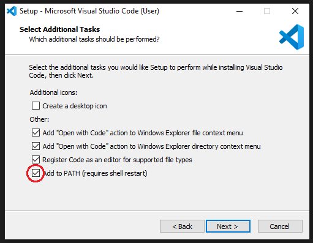

(page_install_ds_stack_windows)=
Windows Install Instructions
=======================

<!-- Open links in a new tab unless they have the `` attribute -->
<head>
    <base target="_blank">
</head>

These instructions will walk you through installing the required Computer Science software stack for {{ COURSE_CODE }}. 
Before starting, ensure that your laptop meets the minimum requirements:

- runs one of the following operating systems: 
    - Macs: 
        - Latest: macOS 12.1
        - Recommended: macOS 10.14.6 or higher
        - Required: macOS 10.11 (El Capitan)
    - Windows: 
        - Latest: Windows 11
        - Recommended: Windows 10 (64-bit) or higher
        - Required: Windows 7 or higher
    - Ubuntu: 
        - Latest: Ubuntu 21.10
        - Recommended: Ubuntu 20.04 or higher
        - Required: version 18.04
- can connect to networks via a wireless connection
- has at least 25 GB disk space available
- has at least 4 GB of RAM
- uses English as the default language (if you want TAs or the instructor to help you)
- student user has full administrative access to the computer

**We will do our best to help you if your laptop does not meet the minimum requirements, but there are no guarantees we will be able to get things to work so be warned.**

## Web browser

You are welcome to use most modern browsers that have a WebKit or Gecko backend.
[Safari](https://www.apple.com/ca/safari/), [Firefox](https://www.mozilla.org/en-CA/firefox/new/?redirect_source=firefox-com), [Vivaldi](https://vivaldi.com), [Brave](https://brave.com), [Edge](https://www.microsoft.com/en-us/edge) are all recommended.
Google Chrome is not recommended because of the [well-documented privacy and tracking issues with Google](https://www.forbes.com/sites/zakdoffman/2021/03/20/stop-using-google-chrome-on-apple-iphone-12-pro-max-ipad-and-macbook-pro/).

## Zoom

We will be using Zoom in this course for the classes, as well as the labs, and student hours.
It is *very* important that you have the most recent version of Zoom installed, as we will be using many of the features that are only available in more recent versions.

The latest version of Zoom as of January 2022 is: `5.9.1 (3506)`.
You can ensure you have the latest version of Zoom by clicking "Check for Updates" as shown in the screenshot below.


```{important}
Please note that if you have been relying on the "web version" of Zoom that works only in a browser, this will not work for this course! Please make sure to download the Zoom desktop client for your operating system to fully participate in the course.
```

## Visual Studio Code

The open-source text editor Visual Studio Code (VS Code) is both a powerful text editor and a full-blown Integrated Development Environment (IDE). 
Go to [https://code.visualstudio.com/download](https://code.visualstudio.com/download) and download the windows version of VS Code.
After the download has finished, run the installer and accept the default configuration for all pages except for the following:

- Also on the **Select Additional Tasks** page check all four boxes under "Other"
    - "Add 'Open with Code' action to Windows file context menu"
    - "Add 'Open with Code' action to Windows directory context menu"
    - "Register Code as an editor for supported file types"
    - "Add to PATH" (this should be selected by default).
- *Optional* On the **Select Additional Tasks** page, check "Create a desktop icon" under "Additional icons".



### VS Code extensions

The real magic of VS Code is in the extensions that let you add languages, debuggers, and tools to your installation to support your specific workflow. From within VS Code you can open up the [Extension Marketplace](https://code.visualstudio.com/docs/editor/extension-gallery) to browse and install extensions by clicking on the Extensions icon in the Activity Bar indicated in the figure below.


To install an extension, you simply search for it in the search bar, click the extension you want, and then click "Install".
There are extensions available to make almost any workflow or task you are interested in more efficient! 
To do this, search for and install the following extensions:

- Java Extension Pack (0.12.1) by Microsoft
- Processing Language (1.4.5) by Tobiah Zarlez
- markdownlint (markdown linting and style checking extension)
- GitLens - Git supercharged (powerful extension that extends VS Code's native git capabilities)
- (Optional) Bracket Pair Colorizer 2 (add colour to help distinguish your brackets: (), [], {})

## GitHub.com

In MDS we will use the publicly available [GitHub.com](https://github.com/). Please follow the set-up instructions for both below.

Sign up for a free account at [GitHub.com](https://github.com/) if you don't have one already.

## Configure Git on your computer

Although Git and Bash are two separate programs, we are including them in the same section here since they are packaged together in the same installer on Windows.
Briefly, we will be using the Bash shell to interact with our computers via a command line interface, and Git to keep a version history of our files and upload to/download from to GitHub.
We will be using the command line version of Git as well as Git through RStudio and JupyterLab.
Some of the Git commands we will use are only available since Git 2.23, so if you're Git is older than this version, we ask you to update it.

Go to <https://git-scm.com/download/win> and download the windows version of git. After the download has finished, run the installer and accept the default configuration for all pages except for the following:

- *Optional* On the **Select Components** page, check "On the Desktop" under "Additional icons".
- On the **Choosing the default editor used by Git** page, select "Use Visual Studio Code as Git's default editor" from the drop-down menu'


> Note if you wish to pin Git Bash to the taskbar, you need to search for the program in the start menu, right click the entry and select "Pin to taskbar". If you instead first launch the program and pin it by right clicking on the taskbar icon, Git Bash will open with the wrong home directory (`/` instead of `/c/users/$USERNAME`.

After installation, test if you were successful by opening the Git Bash program. Below is a picture of the Git Bash icon on the Desktop and an opened instance of the Git Bash terminal (we will often refer to this as just "the terminal"):


In the terminal, type the following to check which version of Bash you just installed:

```
bash --version
```

The output should look similar to this:

```
GNU bash, version 4.4.23(1)-release (x86_64-pc-sys)
Copyright (C) 2019 Free Software Foundation, Inc.
License GPLv3+: GNU GPL version 3 or later <http://gnu.org/licenses/gpl.html>

This is free software; you are free to change and redistribute it.
There is NO WARRANTY, to the extent permitted by law.
```

> If you tried to paste the above into the Git Bash terminal, you will have noticed that `Ctrl+V` does not work in Git Bash. Instead you need to right click and select "Paste" or use the `Shift+Insert` shortcut. To copy from the Git Bash terminal you simply select the text you want and it is copied automatically.

> Via right click you can also reach the settings menu where you can configure Git Bash to your preferences, a couple of tips would be to check "Mouse -> Clicks place command line cursor" and change the font to something more legible, e.g. Consolas ("Text -> Select").

Let's also check which version of git was installed:

```
git --version
```

```
git version 2.28.0.windows.1
```

You can launch many windows programs from the Bash terminal, e.g. to launch VS Code that we installed previously, you would type in `code`, let's use this to check the version of vscode that we installed:

```
code --version
```

```
1.63.2
899d46d82c4c95423fb7e10e68eba52050e30ba3
x64
```

### Configuring Git user info

Next, we need to configure Git by telling it your name and email. To do this type the following into the terminal (replacing Jane Doe and janedoe@example.com, with your name and email (the same used to sign up for GitHub), respectively):

```
git config --global user.name "Jane Doe"
git config --global user.email janedoe@example.com
```

> Note: to ensure that you haven't made a typo in any of the above, you can view your global Git configurations by either opening the configuration file in a text editor (e.g. via the command `code ~/.gitconfig`) or by typing `git config --list --global`.

### Setting VS Code as the default editor

To make programs run from the terminal (such as `git`) use VS Code by default, we will modify `~/.bash_profile`. First, open it using VS Code:

```
code ~/.bash_profile
```

Append the following lines:

```
# Set the default editor for programs launch from terminal
EDITOR="code --wait"
VISUAL=$EDITOR  # Use the same value as for "EDITOR" in the line above
```

Then save the file and exit VS Code.

> Most terminal programs will read the `EDITOR` environmental variable when determining which editor to use, but some read `VISUAL`, so we're setting both to the same value.

### Create your GitHub "Personal Access Token"

This is a bit tricky, so please make sure you follow these directions carefully.

1. Create a Personal Access Token on GitHub.com by clicking this link: https://github.com/settings/tokens/new; make sure to COPY the token that they give you, it is basically a special password that you can use in the Terminal. Detailed steps are:

- Log in to GitHub.com, 
- Click your picture in the top right, 
- Click Settings, 
- Click Developer Settings
- Click "Personal access tokens", set the appropriate permissions at the "repo" level (see gif below):


- Set the Expiration to "No Expiration"
- Click "Generate new token"
- Save this token somewhere on your computer, you will need it when you clone a repository to your computer.
- Don't share your token with anyone and protect it like it's your password! You will not be able to come back to this page to get your token. If you forget it, or lose it, you can just delete the token and create another one.

```{warning}
Please make sure you set the expiration date of the personal access token to be "No Expiration", otherwise you will lose access to GitHub at the WORST possible time and have to do this again.
```


## Processing

To install the Processing Development Environment (PDE), you should follow these steps:

1. [Visit the download page](https://processing.org/download/).
1. Download the installer for the latest version (v4.0 beta 2) your operating system (Windows, macOS, or Linux)
1. See the installation instructions for your operating system ([adapted from here](https://processing.org/tutorials/gettingstarted/)):

    - On Windows, you'll have a .zip file. Double-click it, and drag the folder inside to a location on your hard disk. I suggest a location where your other programs are stored. Once it's moved out of the unzipped folder, you can double-click processing.exe to start.

    - On macOS, the installer is also a .zip file. Double-click it and drag the Processing icon to the Applications folder. Then double-click the Processing icon to start.

    - The Linux version is a .tar.gz file. Download the file to your home directory, then open a Terminal window, and type: `tar xvfz processing-4.0b2-linux64.tgz`. This will create a folder. Then change to that directory: `cd processing-4.0b2` and then run it by typing `./processing`.

## That's it!

You have completed the installation instructions, well done 🙌!
Remember to add a screenshot as instructed in your lab!

### Attributions

```{important} 
This guide has been adapted from the UBC-Vancouver [MDS Install stack](https://ubc-mds.github.io/resources_pages/installation_instructions/) under a CC-BY-SA 4.0 license.
```

* [Harvard CS109](http://cs109.github.io/2015/)
* [UBC STAT 545](http://stat545.com/packages01_system-prep.html#mac-os-system-prep) licensed under the [CC BY-NC 3.0](https://creativecommons.org/licenses/by-nc/3.0/legalcode).
* [Software Carpentry](https://software-carpentry.org/)
* [Oracle - How do I set or change the PATH system variable?](https://www.java.com/en/download/help/path.xml)
* [Numerical Methods - Getting started](https://clouds.eos.ubc.ca/~phil/numeric/python.html)
* [MDS Data Science Install Stack](https://ubc-mds.github.io/resources_pages/installation_instructions/)