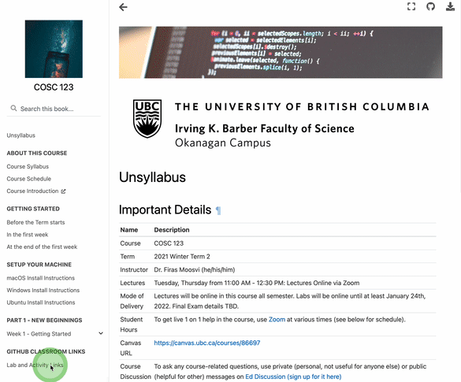
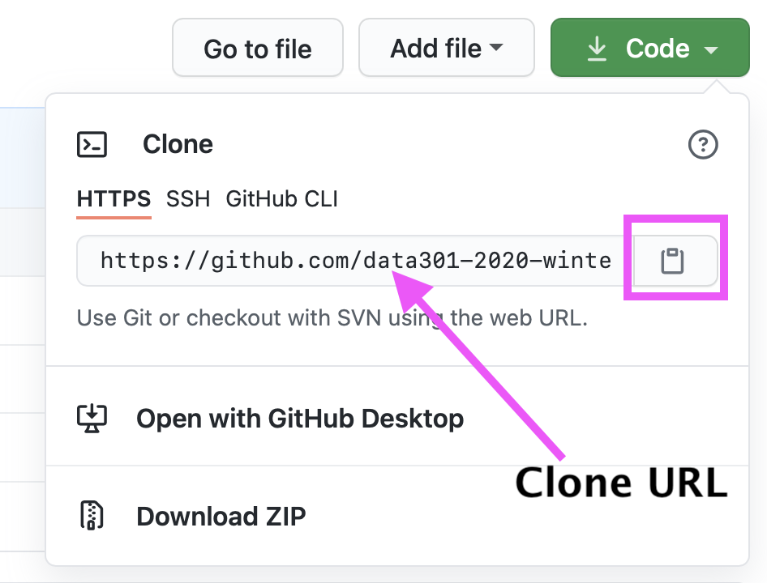
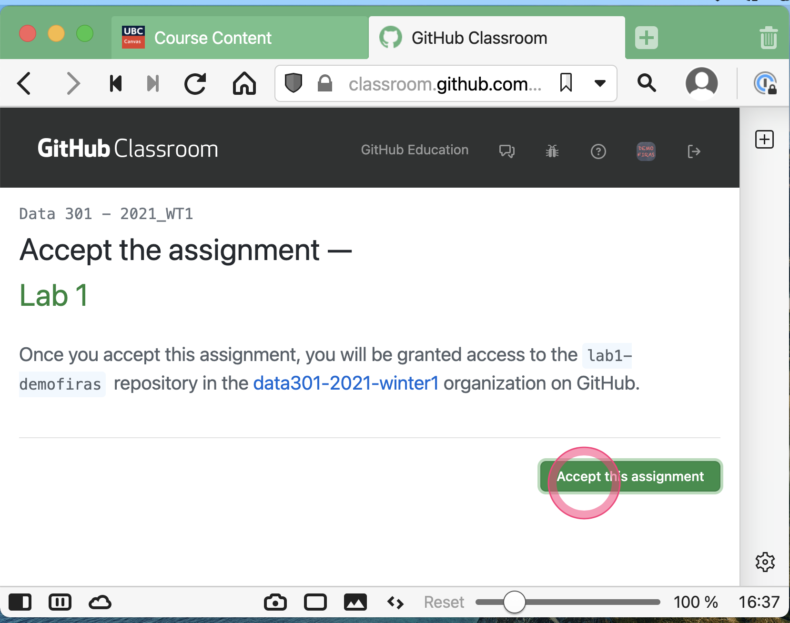

# Task 1 - Set up your computer

There are several things you need to install on your computers for this course, depending on the operating system you use:

- [macOS](https://firas.moosvi.com/courses/2021_WT2/cosc123/class/setup/macOS.html)
- [Windows](https://firas.moosvi.com/courses/2021_WT2/cosc123/class/setup/windows.html)
- [Linux](https://firas.moosvi.com/courses/2021_WT2/cosc123/class/setup/ubuntu.html)

Once you have gone through the installation instructions, please take a screenshot with the following requirements:

- One terminal window with the output of `git config --list --global`
- Another terminal window with the output of `code --version` and `git --version` sequentially printed
- Open the "Processing4" app on your computer, and in the new window, run the following code:
```
ellipse(15,30,25,50);
```
- VS Code showing as installed.
- The date/time should be visible somewhere in the screenshot (top right on macOS and bottom right on Windows).

Here is an example of what you should be aiming for (don't worry about the annotations):


**See Task 1.3 on how to add this screenshot to your repository.**

## Getting Started

Once you are done with the install instructions, you can get started with the rest of this Lab.

## Task 1.1: Accept the lab assignment

- You will find the link to accept the lab on Canvas, under "Course Content" and then "GitHub Links".



- You can get your clone URL from GitHub:



## Task 1.2: Use the clone URL and clone the Lab 1 repository on your local computer and navigate to that directory

- Open a new Terminal - when you do, generally you will start in your home directory (on Windows this will be `C:\Users\yourusername\` and on macOS and Ubuntu this wil be `/Users/yourusername`). You can check your home directory by typing `pwd` (print working directory) and hitting enter.


- To navigate to a new directory, you will need to use the `cd` command and use tab-completion to find the directory on your computer where you cloned this lab:

```
cd ~/school/year1/cosc123/lab1-github-username
```
**Note: you may choose a different directory structure, based on how you keep your coursework organized on your machine. If you do not currently organize your coursework in a particular way, I suggest using the structure above.

- You will then need to clone the GitHub repository somewhere locally (I suggest a directory structure like the one I above):

```
git clone https://github.com/cosc123-2021-winter2/lab1-YOUR_USER_NAME.git
```



## Task 1.3: Add, commit, and push your changes to GitHub

Once you are done cloning `Lab1` and have completed the installation instructions, you will need to include the screenshot you took above.

Add the screenshot to the repository (in the main directory is fine).

Remember to adjust the name of your screenshot file (it should match exactly, including the extension. Mine is `.png`, yours could be a jpg, or bmp or tiff) and add your own commit message):

```
git add screenshot.png
git commit -m "Added System Installation screenshot"
git push
```

Onwards to [Task 2](./Task2.md)!