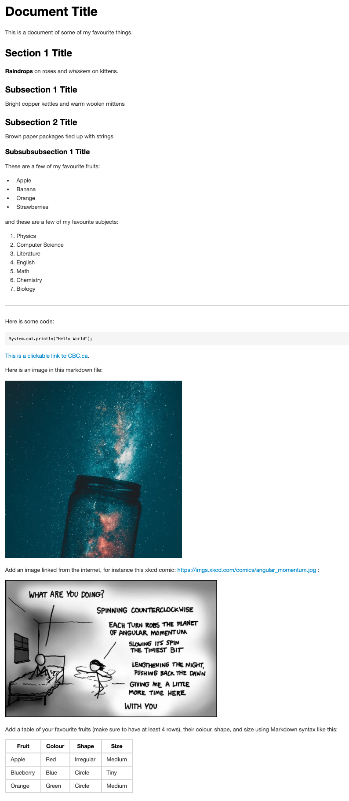

# Task 2 - Learning Markdown

Markdown is a very useful "markup" language that is very popular in Data Science.
Usually when you want to create a document, your first instinct is likely to open a Microsoft Word, Google Doc, Pages, LibreOffice Writer etc...
In any of those word processor or typesetting programs, to add bold text, headings, italics, links, and other formatting you typically need to click buttons or find things in menus.
This does not make it easy to collect a history of what has happened to every line in your document.
Markdown strips away all the "frills" of a word processor and helps you focus on just the text.
There are no fonts in Markdown (there is only one, the default) and you cannot do everything you can in a traditional spreadsheet program.
But for 99% of the things that people who code have to write, Markdown is more than sufficient!

First, let's get ready by creating a new file to practice in:

## Task 2.1: Creating a new file

1. Create a new file called `activity.md` file and open it in VS Code. You can do this in one line using this command:

```
code activity.md
```
If this does not open a blank file in VS Code, I suggest revisiting the install instructions to make sure that you can open VS Code from the Terminal.

## Task 2.2: Practice Markdown Syntax

While you practice with Markdown syntax, it is useful to see a "Preview" of what it will look like.
Here's the effect of the preview extension you installed in VS Code:


1. Practice adding the following [Markdown elements](https://www.markdownguide.org/cheat-sheet/) into the `activity.md` file.

Your goal is to reproduce the elements in this image:



The image above has the following elements:

- one Level 1 Header (`#`)
- one Level 2 Header (`##`)
- two Level 3 Headers (`###`)
- one Level 4 Header (`####`)
- one unordered List
- one ordered List
- one horizontal line (`---`)
- one code snippet/block (```code here```)
- one link to a website
- one embedded local image (image should be in the `images` folder of this repo)
- one embedded remote image (image should be hosted somewhere on the internet, don't forget to link to the original source for attribution!)
- one table

### Add, commit, and push your changes to GitHub

Add, commit, and then push your changes to GitHub.com using the following commands (we will talk about what exactly this means next time):

```
git add .
git commit -m "Finished markdown syntax."
git push
```

## Task 2.3: Submit your Lab on Gradescope

Once you are done with this assignment, **you will need to submit your repository for grading on Gradescope**.

**NOTE: If you make any changes to your GitHub repository, you MUST re-submit on Gradescope to make sure we grade the latest version of your repository. You may submit on Gradescope as many times as you like.**

I have recorded a video with some instructions on how to submit your lab on Gradescope:

<div style="padding:56.25% 0 0 0;position:relative;"><iframe src="https://player.vimeo.com/video/570761775?badge=0&amp;autopause=0&amp;player_id=0&amp;app_id=58479" frameborder="0" allow="autoplay; fullscreen; picture-in-picture" allowfullscreen style="position:absolute;top:0;left:0;width:100%;height:100%;" title="Submitting your GitHub Classroom assignment via Gradescope"></iframe></div><script src="https://player.vimeo.com/api/player.js"></script>

[Click here to view the video in a new browser window](https://vimeo.com/570761775).

Those same instructions are summarized here in text:

1. Accept the GitHub Classroom assignment for this lab - see "Course Content" on Canvas (if you are reading this, you may have already done this).

1. Clone the assignment to your computer using (remember to use your own unique clone link):

```
git clone https://github.com/demoFiras/lab1.git
```

1. Make changes to your assignment and frequently add and commit your changes:

```
git add .
git commit -m "halfway through Task 1"
```

1. Push your change to GitHub so they are pushed to the cloud (important if your computer is destroyed in a giant ball of fire).

```
git push
```

1. Log in to your Canvas course, and click Gradescope in the left sidebar.

1. You will be enrolled in the course and receive a confirmation email. Gradescope will also open in a new window/tab with your course dashboard and all active assignments.

1. If this is your first time using Gradescope, you will need to set a password:

In the confirmation email you received from Gradescope, click the set your password link.
Enter the same password in the password and password confirmation fields, and click Set Password.

1. You can now access Gradescope through your Canvas course.

1. When in Gradescope, click the course and you will see a list of assignments. Select the assignment you want to submit.

1. The first time you do this, you may need to sync your GitHub account with Gradescope, and GRANT permission to our GitHub organization.

1. Once you log in and link your GitHub account, you should find the repository and submit it to Gradescope.

1. Gradescope will email you a confirmation of your submitted work, with a link to the submission.

Note: If you make any future commits to this repository, you will need to re-submit on Gradescope.

You are all done with this assignment!

Congratulations!