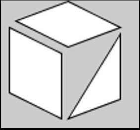

## Task 1 - Rectangles and Triangles

Using your knowledge of drawing shapes, write code in the PDE to draw the following sketch (assume reasonable dimensions):

*Hint: It may help to sketch your drawing on paper first, then try to figure out the coordinates, and then write code.*

## Specifications

- This is essentially a completion exercise, but please ensure that you use at least two shapes in your sketch.
- Add a screenshot of the output of this task to the `screenshots` directory.

## Embed a screenshot of your drawing

Embed the screenshot you added to the `screenshots` directory here using markdown syntax: