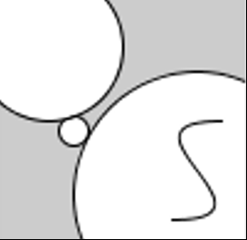

## Task 2 - Ellipses and Beziers

Using your knowledge of drawing shapes, write code in the PDE to draw the following sketch (assume reasonable dimensions):

*Hint: It may help to sketch your drawing on paper first, then try to figure out the coordinates, and then write code.*

## Specifications

- You should reproduce the image above using your own code - please do not worry about making it pixel perfect (i.e. to make sure every pixel is at the correct coordinate). 
- In this task, we are assessing your ability to reproduce an image you see into code.
- Add a screenshot of the output of this task to the `screenshots` directory.

## Embed a screenshot of your drawing

Embed the screenshot you added to the `screenshots` directory here using markdown syntax:
