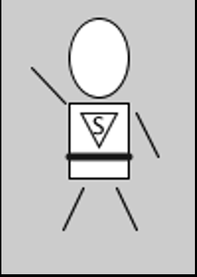

## Task 3 - Put it all together

Write code to design a simple character that looks something like this:

We will use this character throughout the semester in other exercises
so, try to be creative! 
You can add and update this character later too so don't stress too much about getting things perfect! 

No need to worry about color at this point, we will talk about that next week.

Use the easiest drawing mode for aligning your body parts. 
For example, it would be easier if we use the CENTER drawing mode for the torso.

*Hint: It may help to break down your character into multiple simpler shapes by sketching your drawing on paper first, then try to figure out the coordinates, and then write code.*

## Specifications

Include the following items in your character sketch:

- A belt (stroke with larger width).
- A logo on the character chest. 
- The design must have at least one character of text, and a minimum of three shapes.
- There should be some element of creativity and artistic flair to your character.
- Add a screenshot of the output of this task to the `screenshots` directory.

## Embed a screenshot of your drawing

Embed the screenshot you added to the `screenshots` directory here using markdown syntax:
