# Task 4 - Terminology and Tasks

In this task, you need to do some reading to familiarize yourself with common terminology for various actions.
There is nothing you need to submit for this Task, but you are responsible for **all** of the content in this Task.

If you have a Mac, many of the functionalities and features are similar, but the details are different.
I don't yet have a guide to the Mac, but feel free to ask questions on Ed Discussion if you'd like to know the equivalent on your computer.

## Differences between Macs and Windows

A few things that are different between Macs and Windows:
- Shortcuts using `Ctrl` are *normally* mapped to `Command` or `` on Macs.
- The equivalent of "Windows Explorer" on a Mac is the "Finder".
- There is no "task bar" on a Mac, but instead there is a "Dock" which contains your running applications.
- The "System tray" (with the clock, dates, etc) is usually on the top right of your Desktop
- Application Icons are usually in the `/Applications` folder on your Mac, and can be dragged onto the Dock for quick access.
- The buttons to close (red X), minimize (yellow - to minimize to the Dock), and maximize (green icon to Full Screen) are at the top left of the window rather than the top right.
- You can access information about Drives on your Mac by right-clicking on the drive and then selecting "Get Info".
- You can search for files on your Mac using Spotlight.
- 

## The Desktop

After you are logged in to a computer, you will see the **desktop**.
The desktop consists of many components.
The background is an image that you can change.
On the desktop are **icons** that are shortcuts to either programs, files, or folders.
On the bottom is a **task bar** that contains a **Windows Start** button, buttons to open applications, a clock and a **system tray**. 
Icons are opened by double-clicking on them with the left mouse button.
You can go to an open window by clicking on its button in the task bar or cycling through open programs using **Alt+Tab** (**+Tab on Macs**)
If you let your mouse sit (hover) over an icon or button, a pop-up description may appear.

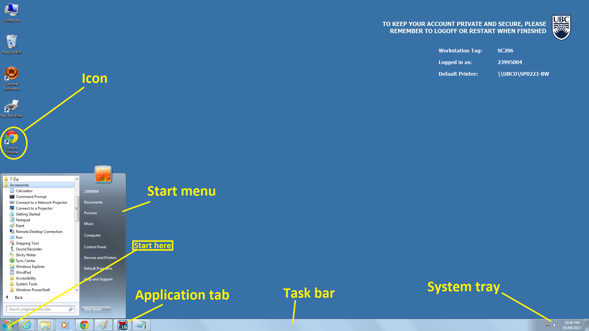

## Start Menu

The **Start Menu** contains links to programs on the computer. Instead of having to find them on the hard drive, a link to the program is provided on the **Start Menu** for you to click to start the program.

**TASK: Open up a Browser (Firefox, Brave, Edge, Safari, etc) using the Start Menu. Open the course website: https://firas.moosvi.com/courses/cosc122/2022_WT1/about/unsyllabus.html**

## Manipulating Windows

You can move, resize, minimize, maximize, and close windows.
The buttons to minimize, maximize, and close are in the top-right hand corner of the window.
You can resize a window by click-and-hold the left mouse button over the bottom-right hand corner of the window border (the cursor should change to a double-ended arrow) and dragging the window to be the desired size.
A window can be moved by click-and-hold the left mouse button on the top window bar and dragging it to its required location.
If a window cannot be resized, these buttons may be greyed out.
If resizing a window makes the window too small to show all information in it, horizontal or vertical scrollbars may appear to scroll through the non-visible information.

**TASK: Minimize, resize, then close the Internet Explorer window opened in Step #3.**

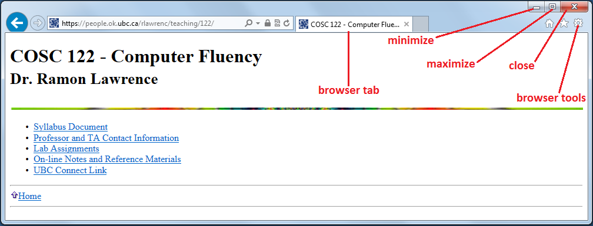

## Applications

An **application** is a software program that performs a task.
Two applications that come with Microsoft Windows are a **calculator** and **WordPad**.
These applications are in the **Start Menu**, under **All Programs**, then **Accessories**.

**TASK: Open up the calculator and compute 765 * 341 - 10.**
**TASK: Open up WordPad. Create a document that looks like the document below and save with the name HelloWorld.rtf.**

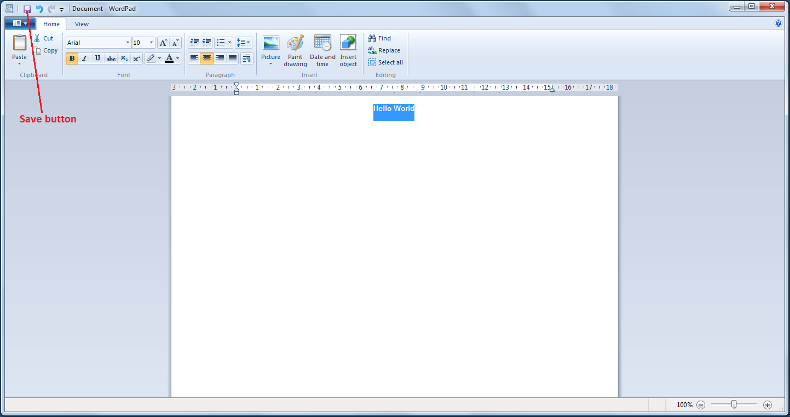

To save a document, click on the purple floppy disk image in the top window bar. You will be asked for a file location. Save it on your **C:** drive which should appear by default as **My Documents**.

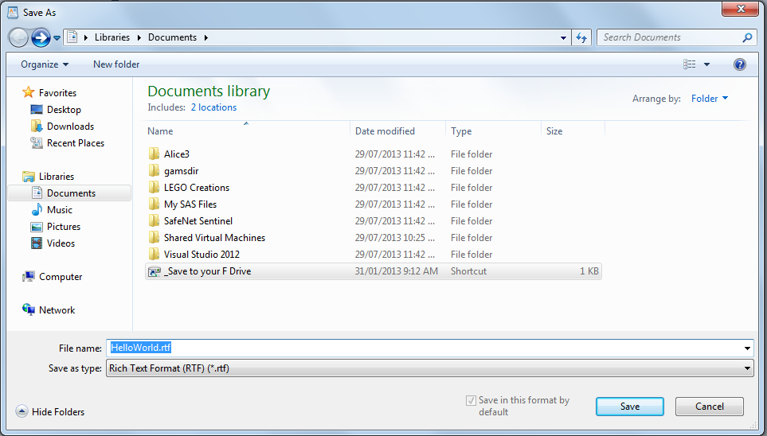

## Getting Help

Most applications have some online help that can be accessed using the **Help menu**.
Below is the help provided with WordPad.

**TASK: Find the Help menu in WordPad and look up how to change page margin sizes.**

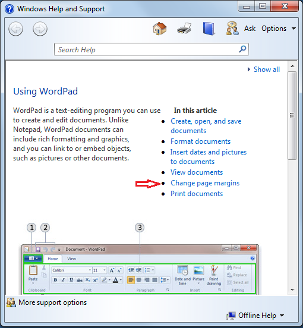

## Desktop Appearance

The appearance of the desktop and screen saver can be changed by doing a right-click on the desktop background (not on top of any icons or windows).
The pop-up menu that appears has the option **Graphics Properties**. Enter the **Basic Mode** of the media control panel.
This will open up a window with several graphics properties you can adjust. 

**TASK: Open up the Graphics Properties. Change resolution to 1024 x 768. Then change it back.**

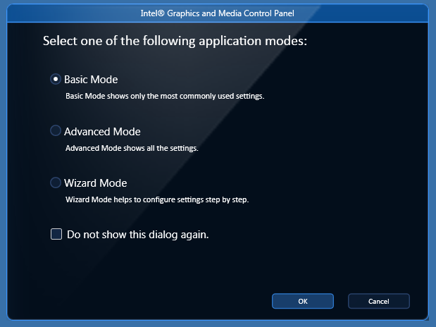

## Windows Explorer

**Windows Explorer** (not **Internet** Explorer) is a graphical interface for the management of your files and folders on your computer.
To open a Windows Explorer window, click on the icon in the task bar that looks like a folder.
If you happen to have multiple explorer windows open already, hovering over this folder will show them to you:

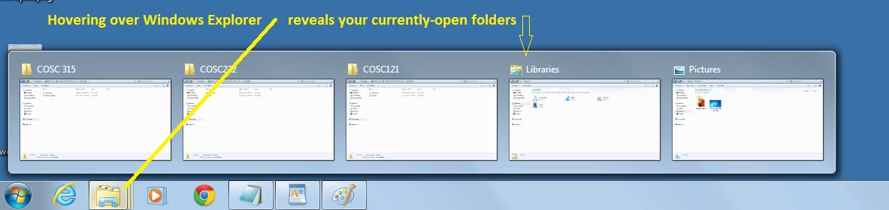

 If you do not currently have any Windows Explorer windows open, clicking on the folder icon will open a new window for you to navigate through your computer.
 If you have existing Explorer windows open, you may open a new Explorer window by right-clicking the folder icon and choosing **Windows Explorer**.

On the left side **pane** (part of the window) are devices and folders.
On the right side pane are the contents of the current folder or device that you selected on the left hand side.
The folders or devices may be physical (actually exist) or logical (virtual).
The **C:** drive is the common name provided for the default hard drive in your computer.
**A:** is used for a floppy, and letters like **D:** or **E:** are used for CD/DVD drives, although this depends on your machine.

You can use Windows Explorer to create files and folders. To create a folder, click on a folder on the left-hand side where you want to put this new folder.
For us, this will be **F:**. Find your F: drive under the **Computer** heading on the left pane of the Explorer window.
Either using the **New Folder** button from the top menu or right-click and selecting **New** then **Folder** from the pop-up menu, you will get a folder.
The folder initially has no name, but you can fill in the name right away.
If for some reason you are not able to fill in the name, right-click on the new folder and select **Rename** from the pop-up menu.

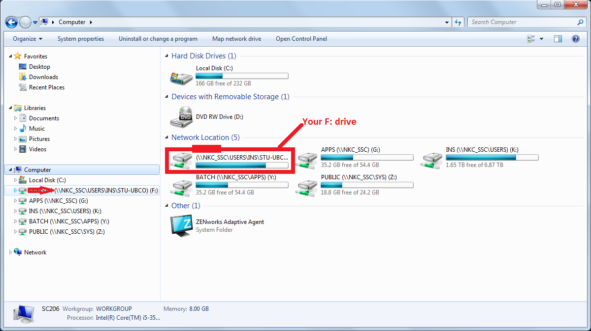

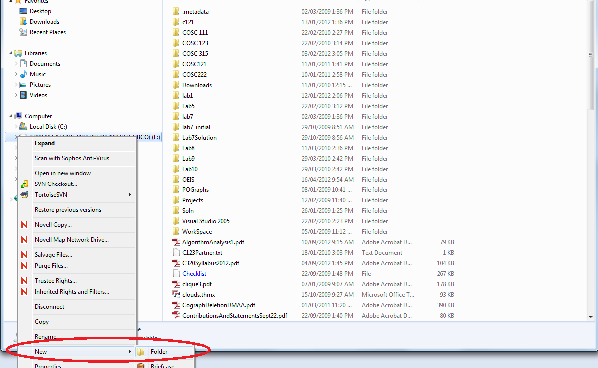

## Step #9: Device Capacities

You can find the **<em>device capacity</em>** or folder size by right-clicking on it and selecting **Properties**.
For devices, this will tell you how much space is used and remaining on that device.
For folders, it will tell you the number and size of files in the folder.

**TASK: Determine the used and free space in GB for your main drive (usually C:/ but could be others as well).**

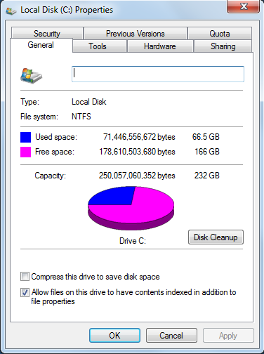

## Step #10: Manipulating Files and Folders

Files can be manipulated in Windows Explorer by right-clicking on them and selecting the appropriate menu item: **Rename**, **Delete**, **Cut**, **Copy**, or **Paste**. These operations can be done by highlighing the file (by left-clicking on it once) and then right-clicking to get the pop-up menu. A quick way to create the multiple folders we will require is to select folder **lab1**, perform **Copy** operation (can even use shortcut **Ctrl+C**), and then perform **Paste** operation multiple times (can use shortcut **Ctrl+V**). Then rename the copies correctly.

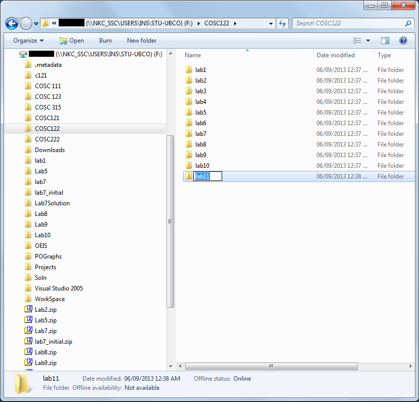

## Step #12: Searching for Files

To find the location of a file on your computer, you can use the **Search..** operation of Windows Explorer.
(This operation can be found in the top-right of an Explorer window.) Type in the name or part of the name of the file you are looking for. You may also find files by date or other properties. Here we are searching for the file that contains the calculator program. Since we do not exactly know its name, we will search for **calc** which says match anything which contains the characters <em>calc</em> in the name. It turns out there are a lot of files that contain those characters. The one with the actual program is **calc.exe**. (The others are unrelated or are shortcut files to the actual program calc.exe.) A **path** is a location of a file on a computer. It consists of the file name and all the directories/subdirectories that must be traversed to get to the file. As an example, the path to the **calc.exe** program shown in the figure below is **C:\Windows\System32\calc.exe**.

**TASK: Perform your own search for the file wordpad.exe (WordPad program) and put the path to the file in a WordPad document called solution.rtf and save in the folder COSC122/lab1.** (Hint: it is in the C:\Program Files\ folder) 

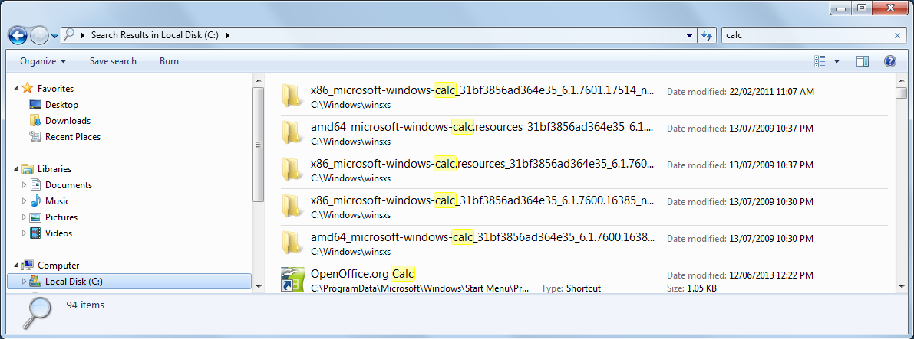

## Step #13: Using Zip Compression

Tools that perform **compression** (often called zip) shrink the size of files using compression algorithms. A program that performs compression is built-into Windows. You use compression to combine multiple folders and files into a single file for submission. This is how we would zip up the directory 122 that we created in a previous step.

### Compression using Windows Compressed Folders

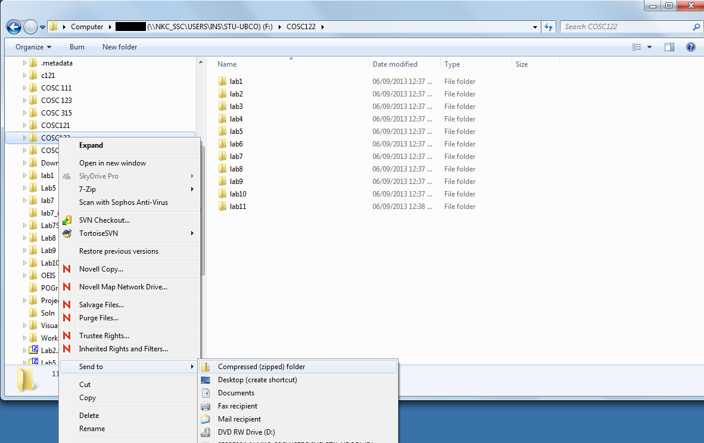

# Web Browsing

A **web page** is a document that contains mark-up that allows it to be displayed graphically by a **web browser**. The page may also contain **hyperlinks** to link to related web pages. A **web server** is a computer on the Internet with the task of storing web pages and responding to clients’ requests for them. The **World Wide Web (WWW)** is the web servers and the files they store.
There are many different software programs that perform the function of web browsing.

## Common Browser Operations

<table border=1>
<tr><th>Operation</th><th>Description</th></tr>
<tr><td>Open/Get Page</td> <td>Retrieve and display a web page from a web server. Performed by either typing address into address bar, using history/favorites, or clicking on hyperlink in current document.</td></tr>
<tr><td>Back</td> <td>Go back to the previous page in the history list.</td></tr>
<tr><td>Forward</td> <td>Go forward to the next page in the history list (only available if viewing a previous page in the history list)</td></tr>
<tr><td>Stop</td> <td>Stop the current web page transfer/download</td></tr>
<tr><td>Bookmark</td> <td>Explicitly save the web address of this page for later.</td></tr>
<tr><td>Submit Form</td> <td>Fill-in data fields and submit FORM data to a server.</td></tr>
<tr><td>Search</td> <td>Search the web for content using keywords.</td></tr>
</table>

Below are screenshots of Microsoft Internet Explorer (IE) and Google Chrome where you can see the user interface components allowing you to perform these common operations.

**TASK: Use IE, Firefox, or Chrome. Open and browse the page www.yahoo.com. Find a current stock quote for IBM.**

### Microsoft Internet Explorer

### Google Chrome

## Web Searching

**Web searching** is the process of finding content on the Internet. There is no master directory of all the content on the Internet, so we use **search engines** to help us find the web sites with the content we need. Common search engines include Google and Bing. Search engines work by allowing us to enter keywords that describe the content we are looking for, and then searching their database to find web sites that have those keywords. The search engine provides us a list of possible web sites which we then browse to (hopefully) find the content we require.

**TASK: Using the search feature of yahoo.com (or another search engine), find the age of Sir John A. Macdonald when he died.**

## Advanced Operations

### Using Forms

Browsing normally means retrieving and reading web content. However, users can interact with web servers by filling in forms and sending that data to the web server. This is required in order to communicate data to the server for making purchases, logging in, and a variety of other uses.

Below is a screenshot showing a search form to find courses at UBC Okanagan. The user has already clicked the Search for Sections (SUBMIT) button and sees some results.

If you click the browser Refresh button, this message appears: 
#### Google Chrome

#### Microsoft Internet Explorer

If you click Cancel in Firefox nothing happens, in Internet Explorer you will see this:

What is happening? Well, some web pages are created dynamically from input that you provide to the web server (such as with the search form we just filled out). In order to re-create this page for you (when you asked to refresh), you needed to re-send this data to the server. If you do not, the page cannot be displayed. Clicking refresh and resending the information will allow the page to be displayed.

**TASK: Search for COSC courses that start with the number 2 this semester (e.g. 211).**

### Viewing Source Code

Web pages are written in HyperText Markup Language (HTML).
For any web page in your browser, you can view its source code.
This is useful when you will develop your own pages both to see your code and to see code from other sites that you may want to use.
In Edge, view source by right-clicking the webpage (careful not to right-click on an image or a link) and select <tt>View source</tt>.
In Chrome, use the right-click and select <tt>View page source</tt>.
A screenshot of Internet Explorer's view source code is below.

**TASK: View source code for the page http://www.google.ca**

### Changing Options

You can change numerous options about your Internet browsing experience.
Two common things to change is your startup (home) page and to clear your browser cache.
Clearing your cache removes all web pages that were stored on your machine.
The **cache** makes browsing faster as the copy is shown to you (if possible) rather than retrieving it from the web site.

**TASK: In your browser, change your startup page to www.yahoo.com and clear the cache. Open a new browser window.**

# Email

**Email** is an application on the Internet that allows you to transfer electronic messages between users.
To use email, you need an email account.
An **email account** provides you with a **unique email address** and a **server** that stores and forwards messages on your behalf.
There are many free email services on the web where you can register for an email account (Hotmail, Gmail, etc.).

## Basic Email Operations

<table border=1>
<tr><th>Operation</th><th>Description</th></tr>
<tr><td>Send</td> <td>Send an e-mail to one or more people (email addresses).</td></tr>
<tr><td>Receive</td> <td>Retrieve email messages from the server.</td></tr>
<tr><td>Read</td> <td>Read an email message</td></tr>
<tr><td>Compose/Reply</td> <td>Create a new email message or reply to an existing one.</td></tr>
<tr><td>Forward</td> <td>Forward (re-direct) an email message to another person.</td></tr>
</table>

## Email Components

<table border=1>
<tr><th>Component</th><th>Required?</th><th>Description</th></tr>
<tr><td>Subject Line</td><td>Yes</td><td>One line description of email contents. Required but may be empty.</td></tr>
<tr><td>To</td><td>Yes</td><td>Email address(es) that message should be sent to.</td></tr>
<tr><td>From</td><td>Yes</td><td>Email address of person sending email.</td></tr>
<tr><td>CC</td><td>No</td><td>Email address(es) that should also be sent the message (Carbon Copy).</td></tr>
<tr><td>Bcc</td><td>No</td><td>Blind Carbon Copy - Email address(es) to also send message, but any addresses in this line will not be visible to receivers.</td></tr>
<tr><td>Text Body</td><td>Yes</td><td>The text body contains the message of the email. It can be empty, but always exists.</td></tr>
<tr><td>Attachment</td><td>No</td><td>Attachments are files that are sent along with the text email (such as pictures, documents, etc.).</td></tr>
</table>

**TASK: Using your email. Send a file to yourself with a picture as an attachment.**

## Specifications

Remember that we are using a "Specifications Grading" system for the labs in this course.
[More details are available in the Unsyllabus](https://firas.moosvi.com/courses/cosc122/2022_WT1/about/unsyllabus.html#specifications-grading)

For this task, the specifications are:

- Read over all the items in this Task, there is nothing else you need to submit here.

Remember that though each task has separate specifications, you will only get **one** combined grade for each lab (E,G,R or I).
You will get feedback for each of the tasks separately.