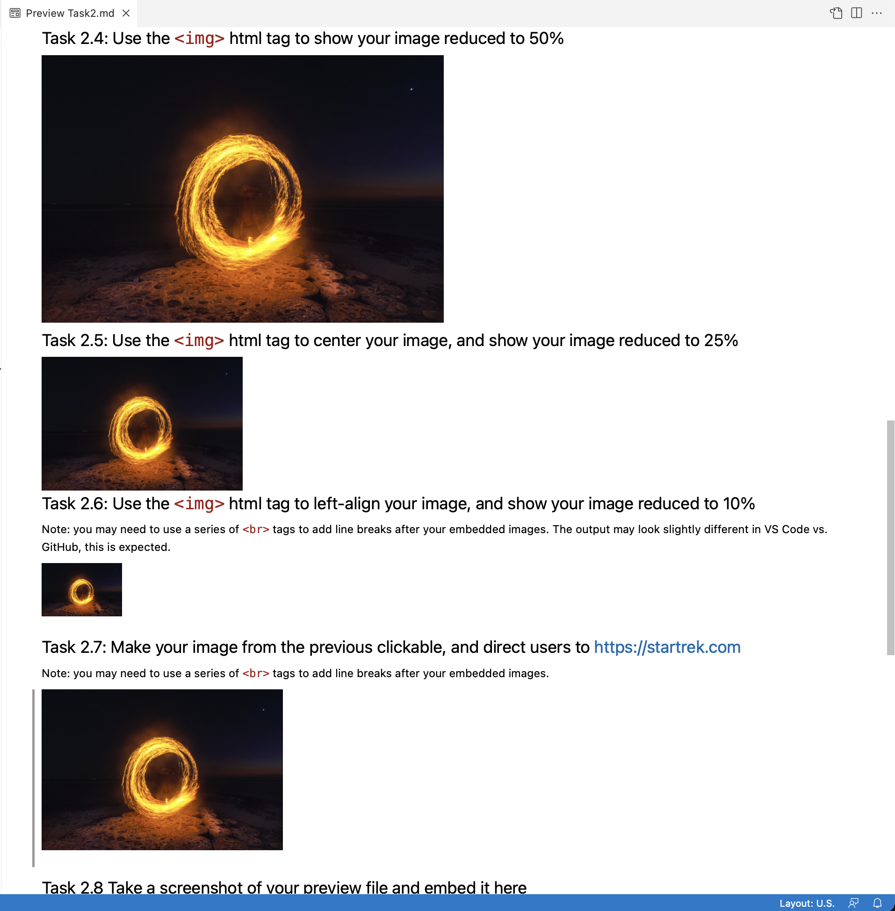

# Task 2 - Intro to HTML

As we talked about in class, as good as the Markdown syntax is, it does have some limitations.
Let's explore how we can use `<html>` tags to help us extend the Markdown syntax.

## Task 2.1: Creating a new file

In the VS Code web-editor, click "File", then "New Text File", and then save the file as `activity_task2.md`.

## Task 2.2: Add an image using Markdown

This is a repeat of something you did in Task 1, you can use the same image as in Task 1, or use any other image.
For the rest of Task 2, you should use the exact same image.

Add a local (i.e. on your computer/repository) image to this file, like this:
```

```

## Task 2.3: Use the `` html tag to embed an image

Your image should be embedded in your Markdown file using the `` tag.

## Task 2.4: Use the `` html tag to show your image reduced to 50%

## Task 2.5: Use the `` html tag to center your image, and show your image reduced to 25%

## Task 2.6: Use the `` html tag to left-align your image, and show your image reduced to 10%

Note: you may need to use a series of `<br>` tags to add line breaks after your embedded images. The output may look slightly different in VS Code vs. GitHub, this is expected.

## Task 2.7: Make your image from the previous clickable, and direct users to https://startrek.com

Note: you may need to use a series of `<br>` tags to add line breaks after your embedded images.

## Task 2.8 Take a screenshot of your preview file from Task 2.4-2.7 and embed it here

It should look something like this:



That's it! Onwards to Task 3

## Specifications

Remember that we are using a "Specifications Grading" system for the labs in this course.
[More details are available in the Unsyllabus](https://firas.moosvi.com/courses/cosc122/2022_WT1/about/unsyllabus.html#specifications-grading)

For this task, the specifications are:

- Create a file `activity_task2.md` in the appropriate location.
- Complete all the elements outlined in the task correctly, and in `activity_task2.md`.

Remember that though each task has separate specifications, you will only get **one** combined grade for each lab (E,G,R or I).
You will get feedback for each of the tasks separately.