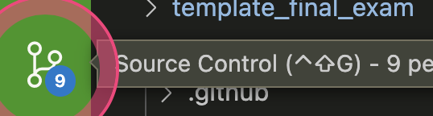

# Task 3 - Learning `<html>`

We are now ready to practice some more html syntax!

At this point, you should have accepted your lab, and have a browser open on your lab repository on GitHub.com.
We will be doing most of this course within a web browser, using the Visual Studio Code (VS Code for short) web editor.

See Task 1 on how to activate the VS Code web editor.

## Task 3.2: Create a new file

In the VS Code web-editor, click "File", then "New Text File", and then save the file as `activity_task3.html`.

**Note: we have now created a file with the extension `.html`, this means that it is an `HTML` file only, and the normal Markdown syntax will NOT work! This is by design so you can practice and debug `HTML` files.

## Task 3.2: Practice HTML Syntax

You will note that this is very similar to the task you did in Lab 1 Task 2, just with `HTML` instead of markdown.

1. Practice adding the following [HTML elements](https://htmlcheatsheet.com) into `activity_task3.html`:

    - Add a level 1 heading using "H1".
    - Add a level 2 heading using "H2".
    - Add a level 3 heading using "H3".
    - Add a level 4 heading using "H4".

**Remember what we talked about regarding "white space" in HTML and use that information when writing your HTML file.**

---

2. Write a sentence (any sentence) after each of the four headings and sub-headings you created. You can [generate and use random sentences here](https://www.lipsum.com). You can use the `
` tag to create a paragraph element.

**Note: It is generally good practice to add an extra (empty) line after any tag to make it easier to read your document.**

- Make a single word in one of the sentences you wrote above *italics* by surrounding the word with the italics `html` tag.
- Make a single word in one of the sentences you wrote above **bold** by surrounding the word with the bold `html` tag.

---

3. Create an **unordered** list using the appropriate `html` tag of your favourite fruits using the appropriate `html` tag:
    - Apple
    - Banana
    - Orange
    - Strawberries

4. Create an **ordered** list using the appropriate `html` tag of your favourite subjects amongst the following: Physics, Chemistry, Biology, Math, Computer Science, English, Literature.

    1. Physics
    1. Computer Science
    1. Literature
    1. English
    1. Math
    1. Chemistry
    1. Biology

---

5. Add a table of your favourite fruits using the appropriate `html` tags (make sure to have at least 4 rows), their colour, shape, and size using `html` syntax that renders like this:

| Fruit | Colour | Shape | Size |
|-------|--------|-------|------|
|       |        |       |      |
|       |        |       |      |
|       |        |       |      |

---

1. Add a horizontal line using the appropriate `html` tag.
1. Make a word clickable in your document by linking to any external website like this using the appropriate `html` tags: [link text](https://cbc.ca).

1. Write a line of code using the appropriate `html` tag (hint: it's `<code>`) "in-line" with a sentence like this: `alert("Hello, World!");` (Note, this code is not going to run (we will talk about this later in the course week), it is only going to be formatted slightly differently so it stands out as code compared to the rest of the text.)

### Commit your changes to GitHub

Once you have made changes to your lab, you will need to "commit" them to your repository.

Look for this "branch" icon on the left sidebar, click it.
You should add a very quick message to briefly summarizing your change (so you don't forget), and then click the check mark to "commit" the changes to your repository.

Once you've committed your changes, the badge with the number of changes on the branch icon will go away, and that means you're free to close your browser and walk away from the computer because all your changes have been saved to the repository.

That's it!
You are now done Task 3.

## Specifications

Remember that we are using a "Specifications Grading" system for the labs in this course.
[More details are available in the Unsyllabus](https://firas.moosvi.com/courses/cosc122/2022_WT1/about/unsyllabus.html#specifications-grading)

For this task, the specifications are:

- Create a file `activity_task3.html` in the appropriate location.
- Complete all the elements outlined in the task correctly, and in `activity_task3.html`.
- Create a screenshot and add it to the repository.

Remember that though each task has separate specifications, you will only get **one** combined grade for each lab (E,G,R or I).
You will get feedback for each of the tasks separately.