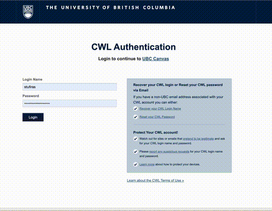

# Lab 3 - Drawing Graphics and Manipulating Images

In this lab, you will be working with a tool called "GIMP", which stands for GNU Image Manipulation to draw graphics and manipulate images.
There are four tasks in this lab, the first task is to get setup with the desktop VS Code app, and the second task is a reading exercise to get you familiar with GIMP.
In Task 3, you will draw your own graphic, and in Task 4 you will be working with an image.

## Submission Instructions

Once you are done with this assignment, **you will need to submit your repository for grading on PrairieLearn**.

Here's a quick gif that should show you how to do it.

- Log onto Canvas and click on your course.
- Click on PrairieLearn in the left sidebar.
- Under the Assessments tab, find the Lab you want to submit
- Click on the question "Submit your Lab"
- Paste the link to your GitHub repository: 
    - For e.g., https://github.com/ubco-W2022T1-cosc122/lab03-demofiras
- Select the number of hours you spent on this lab (this is only for course development and tracking purposes, not for marks!)

You are all done with this assignment!

Congratulations!
