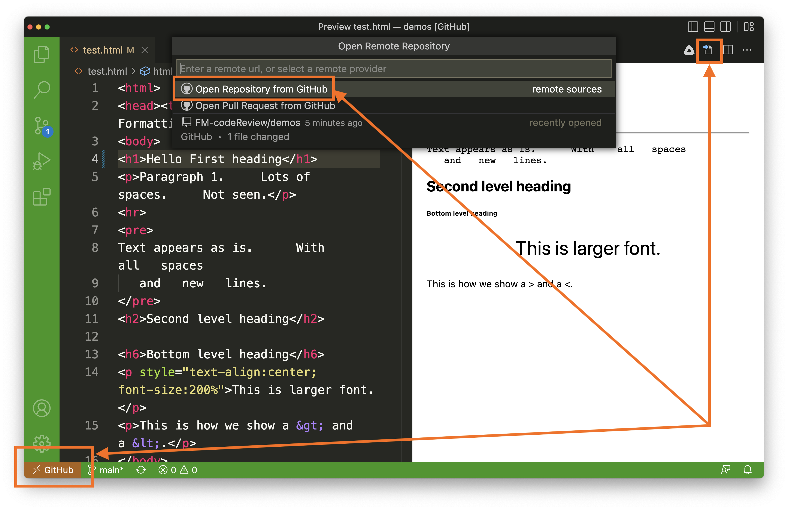

# Task 1 - Install VS Code on your computer

In the first few weeks of the course, we have been making do with the "web-version" VS Code application on GitHub.com (by pressing the `.` key in your repository).
You may have noticed that there are some limitations on the web-version of VS Code.
For example, you could not "Preview" `html` documents through the web-version of VS Code, and not all the extensions work.
Now that you're a bit more familiar and comfortable working in this editor, we can now setup VS Code on our computer.

Here are the instructions to install VS Code on your desktop:

- [Download the Visual Studio Code Application on your Mac or your PC](https://code.visualstudio.com/download)

## Setup the HTML Preview using VS Code

- Install the "GitHub Repositories" extension.
- Authorize your computer with GitHub.
- Install the "HTML Preview" extension.
- Click the ">< GitHub" icon on the bottom left task bar of VS Code, 
    - then click "Open Remote Repository", 
    - then click "Open Repository from GitHub", and then
    - select the lab from the list that you want to work on
- You may need to Authenticate with GitHub, you should use your password
- You should then be able to click on the Preview button to see a rendering of the HTML file!

