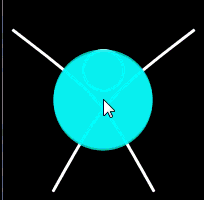

# Task 1: Dancing in the night

Create a scene with a simple “dancer” character and four moving lights similar to this:

Note: the image above is an animated gif - if you cannot see the image moving, try looking at the [mp4 file](images/dancer.mp4) or the [animated gif](images/dancer.gif).

- The dancer’s movements and the lights’ color and position are all controlled by the mouse location.
- The head moves just a bit towards the mouse.

 ***Hints:*** 
- It would be easier if you use the HSB model to control the lights’ color.

- The big X (representing the dancer’s body) is actually two Bezier curves of which the “control points” are moving with the mouse.

## Specifications

- We are expecting you to commit your work often (try to aim for a minimum of 3-5 commits per lab) with useful commit messages marking your progress.
- Create the overall sketch (dancer and four lights).
- Animate the Bezier curves with the mouse.
- Reproduce the head movement the head movement (remember: the head’s location doesn’t match the mouse location).
- Animate the lights color.
- Animate the lights position.

Reminder: You do NOT have to (but you can if you like) duplicate the animated gif exactly, this class is called computer creativity, so be creative!

> For this question, you do not need to include a screenshot, the TAs will download and run your code.