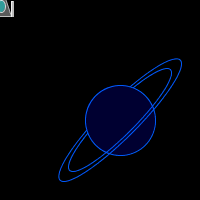

# Task 2: Spaceship

Create a controlled animation that includes a spaceship and a planet. The location of the spaceship is controlled by the mouse as in this animation: 

Note: the image above is an animated gif - if you cannot see the image moving, try looking at the [mp4 file](images/spaceship_planet.mp4) or the [animated gif](images/spaceship_planet.gif).

- The spaceship is semi-transparent with two guns on the sides and an ellipse in the middle.
- Use coordinate transformation to move the spaceship.
- Use another coordinate transformation to draw the
planet.

 ***Hints:*** 
- To use two different coordinate transformations, you will need to save the coordinates before you draw an item, e.g. the planet, and then restore them right after you finish drawing that planet. Use pushMatrix() and popMatrix().
- To draw the planetary rings, use a function called arc() that has the syntax: 
      arc(x, y, w, h, start_angle, end_angle)
      x,y,w,h are the same as an ellipse
      start_angle and end_angle determine the beginning and end of the arc and are specified in radians.
- To hide the mouse curser, use noCursor() function.

## Specifications

- We are expecting you to commit your work often (try to aim for a minimum of 3-5 commits per lab) with useful commit messages marking your progress.
- Effort put into the look of the spaceship.
- Effort put into the look of the planet. (planetary rings must be inclined as in the screenshot)
- Proper use of coordinate transformation for both the spaceship and the planet.
- Moving the spaceship with the mouse.

> For this question, you do not need to include a screenshot, the TAs will download and run your code.