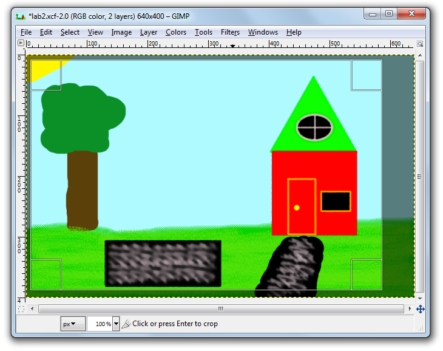

# Task 2 - Learning GIMP

In this task, you will need to do some reading about image creation and editing using GIMP. You do not need to submit anything for this task, however you will need to use the tools outlined here to complete Task 3 and 4.

**Source:** This lab is based on the [image lab for CPSC 111 at UBC Vancouver]("http://www.ugrad.cs.ubc.ca/~cs101/2009W2/labs/GIMP/GIMP.html")

## Image Editing

Image editing software allows you to create and draw images and manipulate digital photos. [GIMP](http://www.gimp.org/) (GNU Image Manipulation Program) is open source software similar to Adobe Photoshop. You will use it to create your own original image and edit and enhance digital photos. The skills learned will transfer to other image editing software. 

Skills you will learn:

- Use freehand tools such as paintbrush, pencil, and ink drawing
- Use selection tools and Gfig to create simple shapes
- Crop and resize images
- Use the "Color Balance" color tool
- Create a unique illustration/picture
- Edit and enhance a digital photograph

## Install GIMP

You may download and install GIMP on your own computer from [GIMP](http://www.gimp.org/).

## Launch GIMP

**TASK: Open GIMP which you can find by searching for "GIMP" in the start menu search bar.**

A window will open up containing a **Toolbox** menu that contains icons for drawing commands on the left and the image manipulation area in the center. You will note that the center area is empty.

### Main Window

### Toolbox Window

## GIMP Drawing Tutorial

To start, under the **File** menu select **New...** and a dialog box will appear. Click **OK** to accept the default image size, although you may change this if you wish.

### New Image Dialog

## Changing the Background Color

- Click on the **Foreground &amp; Background color**  on the **Toolbox** menu. Double click to open the color selection dialog and select a color.
- Select **Bucket Fill** tool () from the menus to fill with a color or pattern. Choose the fill type and click anywhere on the canvas to fill the canvas with your background color.

### Set Background

## Freehand Drawing

 - You can draw using a pencil (), paintbrush (), airbrush ( ), or ink ( ) available on the **Toolbox menu**. Each item has different options that you can select.

 - Click on the **Foreground &amp; Background color**  to change your drawing color.
  - Hold down the mouse button and draw with the brush in the image window.
  - Experiment with the different options. Remember you can undo any drawing using **Ctrl+Z**.

## Shape Drawing

- To draw straight lines with any freehand tool, first click where you want your straight line to begin. Then hold down **shift** and as you move the cursor you'll see a temporary path that shows where your straight line will appear if you click again.
  - To draw shapes like a rectangle or circle, use either the **Rectangular Select Tool** (), **Elliptical Select Tool** (), or **Free Select Tool** ()found on the upper left side of the main toolbar. Once you have placed a selection on your canvas, try going to **Edit-&gt;Stroke Selection**.
  - More complex shapes can be drawn with **Filters -&gt; Render &#8211;&gt;Gfig**.

## Advanced Brush Options

For drawing, you can choose different tool options like opacity, mode, type &amp; size of brush, gradient, and length in the **Toolbox** menu.

## Special Effects

Special effects are under the **Filter** menu and include **Blur -> Pixelize** and **Artistic->Cartoon**.
Use the selection tool to only apply an effect to a portion of your image.

## Cropping

Cropping  removes unwanted areas in your image.
Click and drag a rectangle region on the image to select the portion of the picture you want to keep.
Everything outside of this region will be removed.

## Saving an Image

Save your image by selecting "File", then "Save".
The GIMP native XCF file format allows you to reload your image later and continue.
When you are done, you can also save the image as a png or jpeg.
**Make sure to add the XCF extension when you are saving as GIMP will not do so automatically.**

## Additional Resources

There is a lot more that you can do with GIMP then we have covered in this lab. If you have time, explore the possibilities of GIMP beyond what we have done here.

Helpful links:
- [Download GIMP](http://gimp-win.sourceforge.net/stable.html)
- [GIMP Documentation](http://docs.gimp.org/en/)
- [GIMP Online Tutorials](http://www.gimp.org/tutorials/)

## Specifications

Remember that we are using a "Specifications Grading" system for the labs in this course.
[More details are available in the Unsyllabus](https://firas.moosvi.com/courses/cosc122/2022_WT1/about/unsyllabus.html#specifications-grading)

For this task, the specifications are:

- Read over the all the items of this Task, there is nothing else you need to submit here. You will need these for the next tasks.

Remember that though each task has separate specifications, you will only get one combined grade for each lab (E,G,R, or I). You will get feedback for each of the tasks separately.
