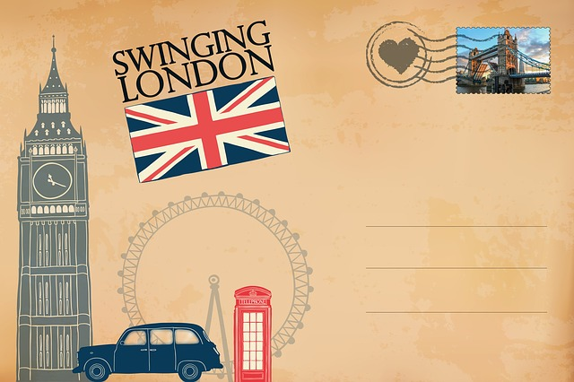

# Task 4 - Editing a Photo

GIMP allows you to perform digital photo editing including changing colours, sharpness, removing unwanted elements and adding new elements.  For Task 4, you will need a digital photograph. 

You can use this image:  Image by Jaime Reimer via [Pexels](https://www.pexels.com/photo/beautiful-view-of-moraine-lake-2662116/).

Or another landscape of your choosing. You can search for landscape images through [Pexels](https://www.pexels.com/).

## Task 4.1 Create a new file

In GIMP's main window, click "File", then select "New...", then a dialog box will appear.  Click "OK" to accept the default image size, although you can change this if you wish.

## Task 4.2 Edit a digital photo

The goal is to try to make it look like a postcard.

Something along the lines of this:



Image by [Stefan Schweihofer from Pixabay](https://pixabay.com/users/stux-12364/?utm_source=link-attribution&amp;utm_medium=referral&amp;utm_campaign=image&amp;utm_content=1038914).

Here are some strategies you may want to use:

1. Change to hue of the image to a sepia tone (or another tone of your choosing).
    - You can also play with layers to only apply the hue to a single layer like the background

2. Crop the image a bit (to show that you know how the crop tool works)

3. Add some text to your picture.

4. Add or change the border texture of your image to try and get it to look like a postcard.

5. Add a stamp or logo to the image, as well as other clipart.
    - You can find [royalty-free clipart here](https://publicdomainvectors.org)
    - You can use clipart from other sources as well (but please make sure you're not using copyrighted images)

## Task 4.3 Add image to the repository

Once you have finished editing the photo, you will need to save it into your repository. Click on "File", then select "Export As...", then save the image as `image_task4.png`.

1. In the VS Code web-editor, click "File", then "New Text File", and then save the file as `activity_task4.md`.

2. Add the edited local images into the file like this: 

```

```

**To access the images from the Markdown file, make sure to drag and drop the png file to the sidebar of your repository**

## Specifications

Remember that we are using a "Specifications Grading" system for the labs in this course. [More details are available in the Unsyllabus](https://firas.moosvi.com/courses/cosc122/2022_WT1/about/unsyllabus.html#specifications-grading).

For this task, the specifications are:

- Create a GIMP file and a Markdown file titled `activity_task4.md`

- Complete all the elements outlined correctly.

- Add the edited to the repository and the Markdown file.

Remember that though each task has separate specifications, you will only get one combined grade for each lab (E,G,R, or I). You will get feedback for each of the tasks separately.
