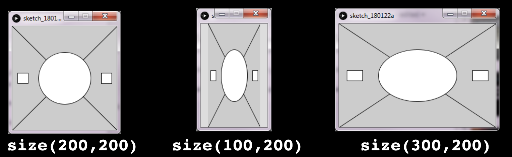

# Task 1 - Using System Variables

Reproduce this result:

## Specifications

- Write code to produce the following sketches so that the code for all three is EXACTLY the same except for the size() statement. 

- That is, the shapes must resize themselves relative to the window size. No matter what you specify for size(), the result should look identical!

*Hint*: use width and height to determine the shapes location and size.

## Embed a screenshot of your drawing

Embed the screenshot of your drawing (not the code) here using markdown syntax: