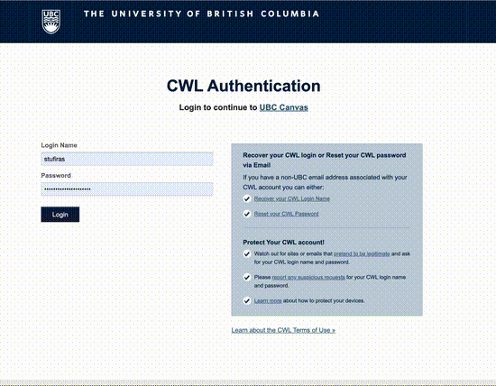

# Lab 4 - Building your own web page

**Warning: This will probably be your longest lab of the term so far with the most amount of "self-study". You will probably need to attend the lab sessions, and ask for lots of help on Ed Discussion to complete this lab. We will also give you a little bit of extra time to work on this lab. Do not leave it to the last minute!**

In this lab, you will be using HTML to build our own web page.
In Task 1, you will learn the basics of CSS (cascading style sheets), and get introduced to Bootstrap, an HTML framework to help you quickly build fast and responsive websites.
In Task 2, you will practice using basic components like Buttons, Badges, Images, and deploy your websites so it can be viewed publicly.
In Task 3, you will practice using the grid system in Bootstrap, and add Cards.
In Task 4, you will practice using Navigation and Navigation Bar components.
In Task 5, you will put it all together and make a fully functioning Bootstrap website!

## Submission Instructions

Once you are done with this assignment, **you will need to submit your repository for grading on PrairieLearn**.

Here's a quick gif that should show you how to do it.

- Log onto Canvas and click on your course.
- Click on PrairieLearn in the left sidebar.
- Under the Assessments tab, find the Lab you want to submit.
- Click on the question "Submit your Lab"
- You may be asked to submit different parts of your file in different questions, follow the instructions to submit each file as stated.
- Paste the link to your GitHub repository: 
    - For e.g., https://github.com/ubco-W2022T1-cosc122/lab01-demofiras
- Select the number of hours you spent on this lab (this is only for course development and tracking purposes, not for marks!)

You are all done with this assignment!

Congratulations!

## Attribution

This lab (particularly Tasks 4 and 5) relies upon the excellent work by [FreeCodeCamp.org](https://freecodecamp.org) and in particular, [Dawid Adach](https://dawidadach.com/en/) founder of [MDBootstrap.com](http://MDbootstrap.com).