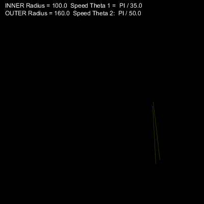
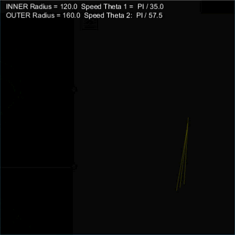

# Task 1: Animation

Create a program that animates the creation of shapes similar to the ones below:

Use the [starter code](./q1/q1.pde) and then complete the missing code in order to create the above animations.
The basic idea is as follows (see the diagrams below):

- Draw a line in each new frame without clearing the previous frames.
- The start and end points of the line should constantly move along the circumference of two circles located at the sketch center. 
- Use circle equations: x = r cos(theta) and y = r sin(theta) to determine the position of the points
- Animate the angle theta for the two points at different speeds. 

## Specifications

- We are expecting you to commit your work often (try to aim for a minimum of 3-5 commits per lab) with useful commit messages marking your progress.
- The origin is moved to the center of the sketch.
- The points (x1,y1) and (x2,y2) are computed using r and theta (circle equations).
- A line is drawn between (x1,y1) and (x2,y2).
- The angles theta1 and theta2 are animated.

## Embed an animated gif of your drawing

Embed the animated gif you created here using markdown syntax: