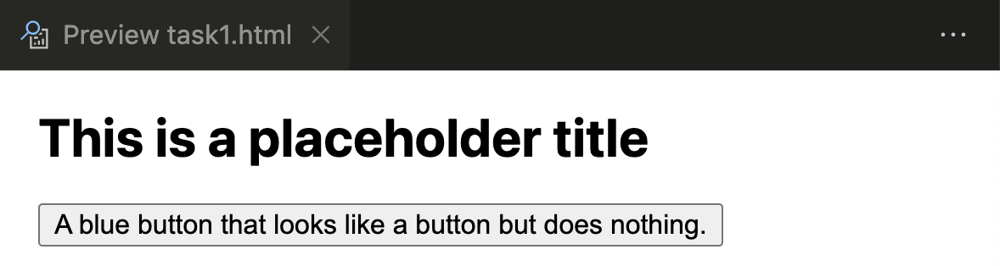
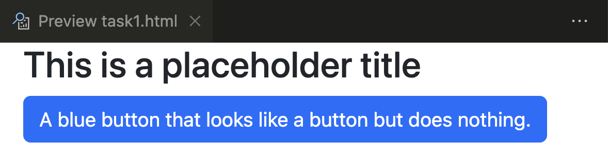

# Task 1

In Task 1, you will learn the basics of CSS (cascading style sheets), and get introduced to Bootstrap, an HTML framework to help you quickly build fast and responsive websites.

## Introduction to Cascading Style Sheets (CSS)

Watch [this video (roughly 8 minutes)](https://www.youtube.com/watch?v=6vbgZnQrpbU) to learn about what CSS is all about, and what it's used for.
The video was created by Edureka!

<iframe src="https://www.youtube.com/embed/6vbgZnQrpbU" title="What is CSS (by Edureka)" frameborder="0" allow="accelerometer; autoplay; clipboard-write; encrypted-media; gyroscope; picture-in-picture" allowfullscreen></iframe>

In this course, writing CSS files is beyond the scope of what you will be expected to do, we will only learn how to *use* CSS styles that are already created by others.
We will be using an open source professional CSS framework called Bootstrap that has taken care of creating all the styles we will ever need.
The framework was developed by Twitter, and is used in tens of millions of websites around the world.

## Introduction to Bootstrap

Watch [this video](https://www.vibby.com/v/mJs6pQinp) (4 minutes and 32 seconds) for an introduction to the Bootstrap framework.

<iframe src="https://www.vibby.com/embed/vib?vib=mJs6pQinp" frameborder="0" scrolling="no" seamless="yes" style="overflow: hidden; width: 100%; max-width: 640px; height: 372px;" allowfullscreen=""></iframe>

## Installation of Bootstrap

- We have created a file called [task1.html](task1/task1.html), where you can experiment with the effect of adding Bootstrap to an HTML file.
- You will be doing everything in this task, in the [task1.html](task1/task1.html) file.

Before adding Bootstrap, you will see something like this:



- Add a link to the Bootstrap CSS file to the `<head>` of the [task1.html file](task1/task1.html) using the CDN method.

    ```
    <link href="https://cdn.jsdelivr.net/npm/bootstrap@5.2.1/dist/css/bootstrap.min.css" rel="stylesheet" integrity="sha384-iYQeCzEYFbKjA/T2uDLTpkwGzCiq6soy8tYaI1GyVh/UjpbCx/TYkiZhlZB6+fzT" crossorigin="anonymous">
    ```

- After adding Bootstrap, the button will have some style added to it, and will look like this:



## Specifications

**Task 1 will not be explicitly graded, since Tasks 2 onwards all rely on you completing Task 1 correctly.**

- Read the contents of the entire Task and be able to explain the effect that CSS styles can have on HTML.
- Be able to explain what Bootstrap is, and why it is a very useful framework for web developers.
- Add the Bootstrap link to the [task1.html file](task1/task1.html) in the `<head>` section.
- Link to [task1.html](task1/task1.html) from your main `index.html` file.
