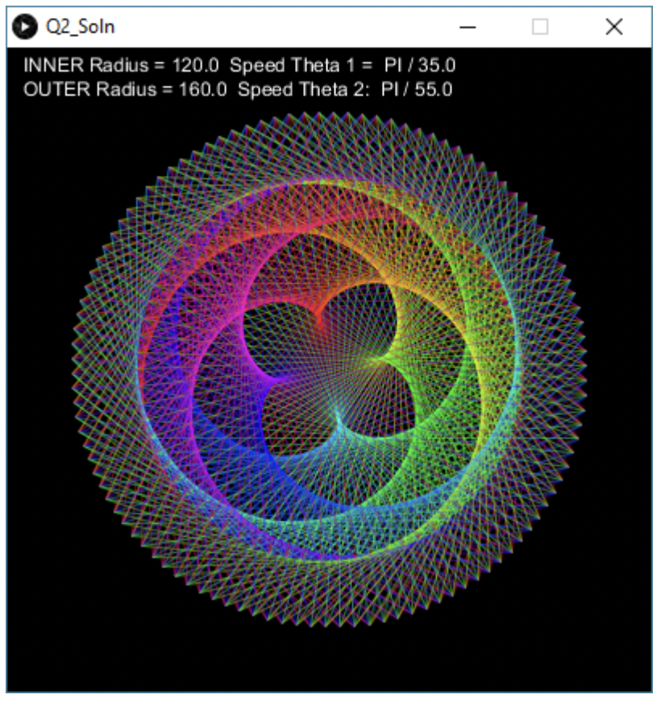

# Task 2: Animation and Color

Add more code to your design in order to also animate the color of the line. A sample output is shown below.

*Hint: use HSB color mode*

## Specifications

- We are expecting you to commit your work often (try to aim for a minimum of 3-5 commits per lab) with useful commit messages marking your progress.
- Rainbow colors are assigned to the lines  as in the screenshot.
- One color is not overused compared to the others. That is, when your reach the end of the color spectrum, you should start all over again, i.e. color1 -> color2 -> … -> color255 -> color 1 -> color 2 -> etc

## Embed an animated gif of your drawing

Embed the animated gif you created here using markdown syntax: