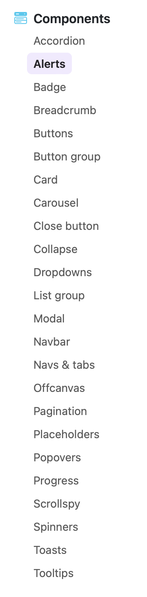
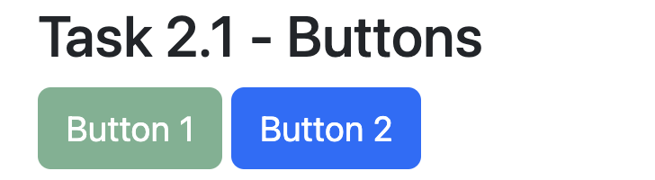
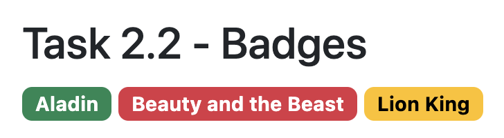
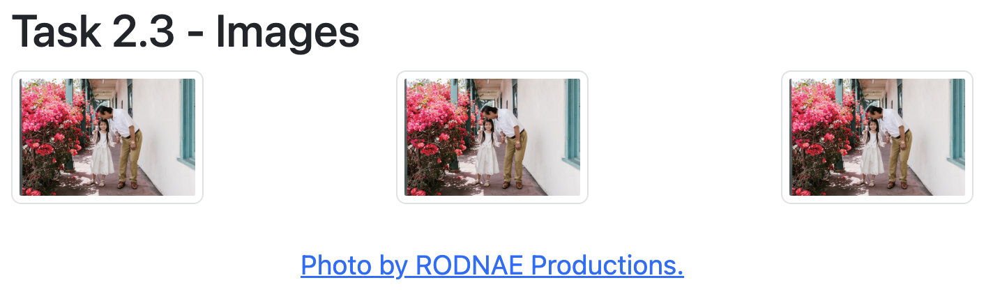
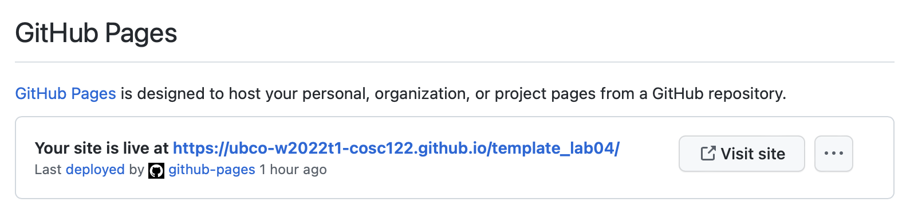
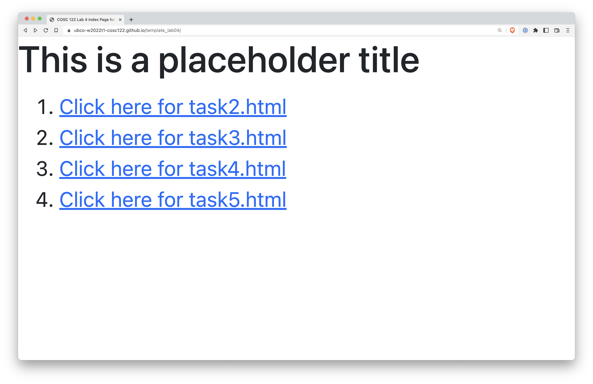

# Task 2

There are dozens of different Bootstrap components available for you to explore and work with.

At this point in the course, you will not be able to use all the components, as some of them require knowing Javascript, which we will learn later on in the course.

In the next few tasks, we will go over some of the key features of Bootstrap and with these, you should be able to make a fully functional, and responsive website.

## Task 2.1 - Bootstrap Buttons

Buttons are a very important component of the Bootstrap framework, as they allow users to interact with, and control actions in forms, dialogs, and other elements.
[Here is a video (about 5 minutes)](https://www.vibby.com/v/mJssn4j3p) introducing the button component.

<iframe src="https://www.vibby.com/embed/vib?vib=mJssn4j3p" frameborder="0" scrolling="no" seamless="yes" style="overflow: hidden; width: 100%; max-width: 640px; height: 372px;" allowfullscreen=""></iframe>

Note that the video is somewhat fast, so feel free to slow it down, or pause it to analyze the syntax.
Try and focus only on the code that is "added" rather than focusing on the elements surrounding the code.
Here is a [link to the documentation about Bootstrap buttons](https://getbootstrap.com/docs/5.2/components/buttons/), that should show you all the options that are possible.

Here's what you need to do for this task:
- You will be doing everything in this task, in the [task2.html](task2/task2.html) file.
- Open [task2.html](task2/task2.html) in VS Code, it has some placeholder `html` to get you started, and some instructions on where to add your code.
- Create two buttons, of two different colours (or, semantic purposes).
- One must be `active`, and the other must be `disabled`.

Here is what we're expecting (but feel free to choose your own colours and text):

## Task 2.2 - Badges

Following a similar procedure as Task 2.1, add three badges (of different colours) to your website and customize the text of each one (with anything you like).
[Here is a link to the documentation about Bootstrap badges](https://getbootstrap.com/docs/5.2/components/badge/#background-colors).

Here is what we're expecting (but feel free to choose your own colours and text):
- Create three different badges, each of different colours and text, and add it to [task2.html](task2/task2.html).

## Task 2.3 - Images

Choose a royalty-free, open-licensed image of your choice from [Pexels.com](https://pexels.com) or [Pixabay.com](https://pixabay.com) for this task.
[Here is a link to the documentation about Bootstrap images](https://getbootstrap.com/docs/5.2/content/images/).

Here's what you need to do for this task:
- Add the same image three times to [task2.html](task2/task2.html) using the standard `` tag.
- Shrink the images so they're smaller on the page using the `width=20%` (or, equivalently `height=20%`).
- Add a rounded 1-px border around your images by adding the `img-thumbnail` class to each of your image tags.
- Add linked text with the attribution credit, make sure it's linked to the image source.
- Add ["alt-text"](https://accessibility.huit.harvard.edu/describe-content-images) for all of your images from here onwards.
- Create a `div` with the `text-center` class, as well as three [`float` classes](https://getbootstrap.com/docs/5.2/utilities/float/) to have one image that is left-aligned, one image that is center-aligned, and one image that is right-aligned.

Here's what we're expecting for this task:

## Task 2.4 - Deploy your website

- Visit your lab repository on GitHub.com.
- Click on "Settings"
- In the left side-bar, click on "Pages"
- In the "Build and deployment" section, under "Source", click the "Deploy from a branch" dropdown, and select "main" (the default is set to None).
- Click Save
- Wait 1-2 minutes
- Come back to the page and reload it, you will see something like this:

- Click "Visit Site", and make sure your website shows up correctly.

- Add a link in the main `index.html` file to link to the [task1.html](task1/task1.html) file using `html` syntax. Here's what you should see when you're done:

Note: Later in this lab you will learn all sorts of fancy components, feel free to apply that knowledge to style your home page, though it's not required (yet).

## Specifications

- Link to [task2.html](task2/task2.html) from your main `index.html` file.
- Display at least two buttons (each of a different colour and "state").
- Display at least 3 badges, of different colours and text.
- Display three images as described in Task 2.3
- Ensure all images have appropriate ["alt-text"](https://accessibility.huit.harvard.edu/describe-content-images).
- Arrange the elements in the [task2.html](task2/task2.html) file in a reasonably logical way.