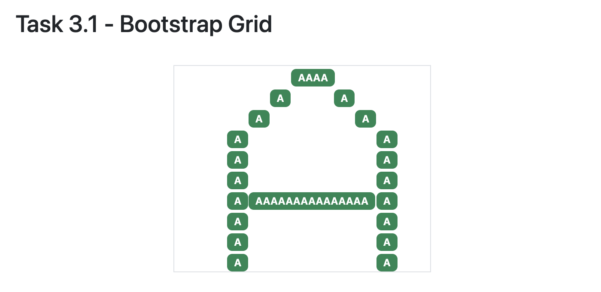
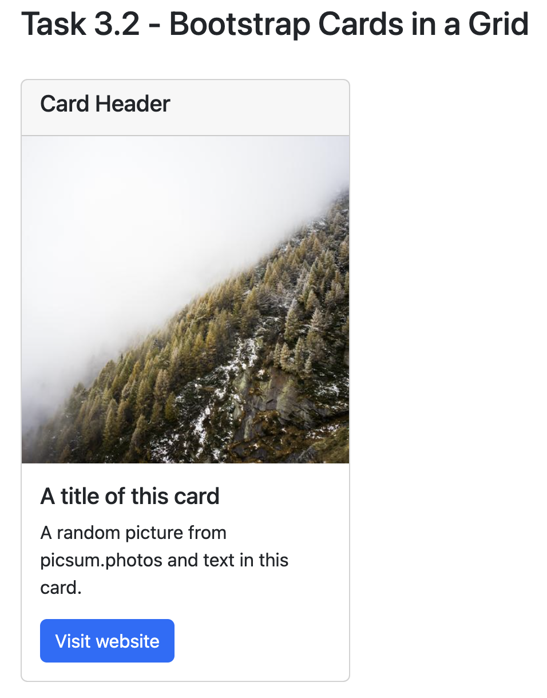

# Task 3

Once you're familiar with adding Bootstrap "classes" to different components, you're ready to take the next step in your web development journey.

## Task 3.1 - Bootstrap Grid

That next step is Bootstrap's "grid" system, an extremely powerful way of doing layouts and alignments.
We'll [start with a video (about 18 minutes)](https://www.vibby.com/v/XJADiVo3T) to introduce you to the Bootstrap Grid system.

<iframe src="https://www.vibby.com/embed/vib?vib=XJADiVo3T" frameborder="0" scrolling="no" seamless="yes" style="overflow: hidden; width: 100%; max-width: 640px; height: 372px;" allowfullscreen=""></iframe>

Here is a [link to the documentation about Bootstrap Grid](https://getbootstrap.com/docs/5.2/layout/grid/), that should show you all the options that are possible, along with many examples.

Here's what you need to do for this task:
- You will be doing everything in this task, in the [task3.html](task3/task3.html) file.
- Pick any letter of the alphabet, and using Badges and the Bootstrap Grid, draw a letter within the provided grid.
- Make sure there are at least 10 rows in your Bootstrap grid (you're welcome to have more than this if you like!).
- In the [task3.html file](task3/task3.html), we've given you a snippet of code to get you started, your task is to fill in your code within this chunk:

```
<div class="container border" style="width: 300px;">

    <!-- the rest of your HTML code (for Task 3) will go here!-->

</div>
```

Here's what we're expecting for this task (feel free to be creative and choose a different letter and use different components to "colour in" the grid cells):



## Task 3.2 Bootstrap Card

Now that we know about Bootstrap Grid, we can start using some of the most powerful and interesting Bootstrap components.
The most commonly used component (other than buttons) is a `Card`.
As usual, [we'll start with a brief video (15 minutes)](https://www.vibby.com/v/mkmMPlh2a) showing you how to use and arrange Bootstrap Cards on a webpage.

<iframe src="https://www.vibby.com/embed/vib?vib=mkmMPlh2a" frameborder="0" scrolling="no" seamless="yes" style="overflow: hidden; width: 100%; max-width: 640px; height: 372px;" allowfullscreen=""></iframe>

Here is a [link to the documentation about Bootstrap Card](https://getbootstrap.com/docs/5.2/components/card/), that should show you all the options that are possible, along with many examples.

Here's what you need to do for this task:

- Create a Bootstrap Card with a header, an image, and a button that links to an external website.

Here's roughly what we're expecting for this task (feel free to be creative and choose different colours and layouts):



## Task 3.3 Bootstrap Cards in a Group

Here is a [link to the documentation about Bootstrap Grid Card](https://getbootstrap.com/docs/5.2/components/card/#grid-cards), that should show you all the options that are possible, along with many examples.

Here's what you need to do for this task:
- Create three Bootstrap Cards with a header, a footer, an image.
- Lay them out within a grid of row size 1, and set it up so that as you make the window smaller the cards get smaller (responsive) and then collapse to a row size of 3.

Here's roughly what we're expecting for this task (feel free to be creative and choose different colours and layouts):


A few hints that might be useful:

- Feel free to use the examples from the [documentation](https://getbootstrap.com/docs/5.2/components/card/#grid-cards), it  will take some trial and error to meet all the specifications.
- Add the appropriate classes to the row div `<div class="row ` to accomplish the behaviour shown in the gif above.
- You can add the `h-100` class to the card divs like this `<div class="card h-100">` to get equal heights of the cards.
- You can use `<small class="text-muted">Last updated 3 mins ago</small>` to add text to the footer.

That's it!
You're done with this task!

## Additional Resources (Optional)

- There's an interesting game called [Flexbox Froggy](https://flexboxfroggy.com) that I thought was cool, but the Flexbox syntax is slightly different so I didn't assign it as a task. If you try it, let me know if was useful to learn, and I'll incorporate it in future labs.

## Specifications

- Link to [task3.html](task3/task3.html) from your main `index.html` file.
- Display a letter of the alphabet in a Bootstrap Grid as described in Task 3.1.
- Display a Bootstrap Card as described in Task 3.2.
- Display three Bootstrap Cards in Grid, and arrange the layout as described in Task 3.3.
- Add appropriate headings to your [task3.html](task3/task3.html) file to organize it.