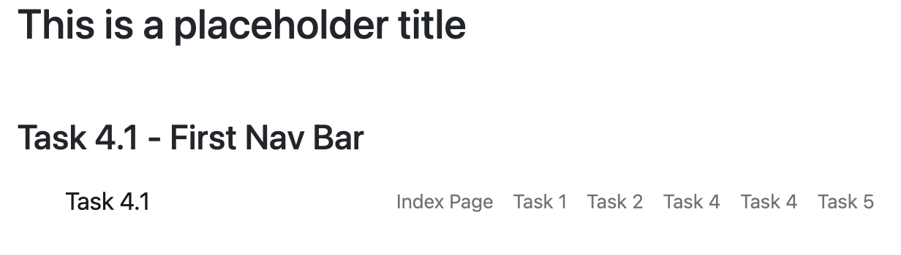
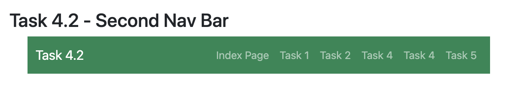
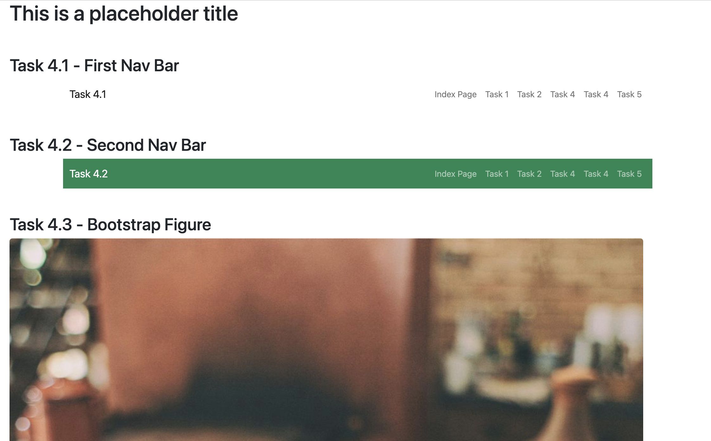
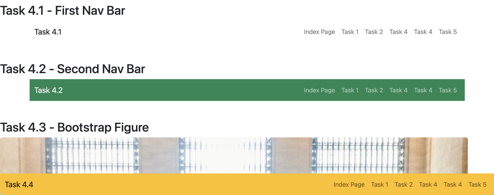
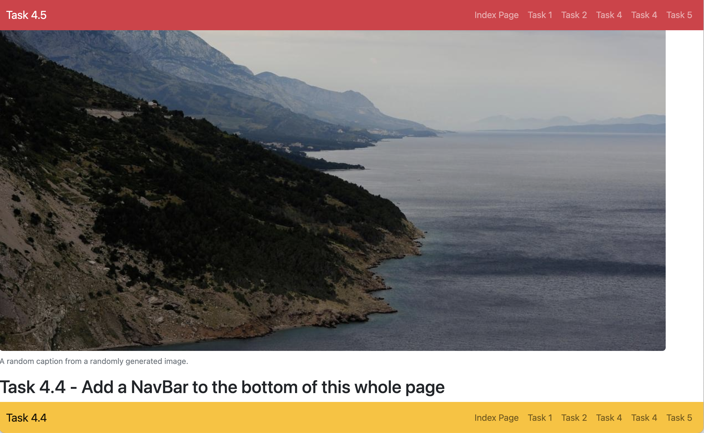

# Task 4

In this Task, you will practice using Navigation and Navigation Bar components.
By now, you should be getting familiar with the [Bootstrap components](https://getbootstrap.com/docs/5.2/components/navbar/).

## Task 4.1 - First NavBar (light)

As usual, [here's the portion of the FreeCodeCamp lesson on Bootstrap NavBars](https://www.vibby.com/v/Qkj9lInnT).

<iframe src="https://www.vibby.com/embed/vib?vib=Qkj9lInnT" frameborder="0" scrolling="no" seamless="yes" style="overflow: hidden; width: 100%; max-width: 640px; height: 372px;" allowfullscreen=""></iframe>

To create your first NavBar (or, navigation bar) start with the [NavBar documentation](https://getbootstrap.com/docs/5.2/components/navbar/).
**Note that since we have not yet imported the JavaScript part of Bootstrap, features such as collapsibility, search functionality, responsive navigation will not be available to us yet.**
You're welcome to add the Javascript if you like (see [instructions here](https://getbootstrap.com)) but we will be learning more about the JavaScript part of Bootstrap later on in the course.

Here's what you need to do for this task:
- You will be doing everything in this task, in the [task4.html](task4/task4.html) file.
- After the `<h1>Task 4.1 - First NavBar (light)</h1>` create a div with the `container` class applied to it, and inside the container Div, create a Bootstrap NavBar, with the links to each of this lab's HTML files, as well as the index page.
- Remember to use `<a class="nav-link" href=...>` for the links, rather than the `<ul>` syntax!
- There should be some text that links to the current page (`href="#"`) on the left of the navbar.
    - You can accomplish the "Task 3.1" on the left of the navbar by adding a `navbar-brand` class added to the `<a>` tag.

Here's roughly what we're expecting for this task (feel free to be creative and choose different colours and layouts):

## Task 4.2 - Switch to a Dark NavBar

Here's what you need to do for this task:

- Very similar to Task 4.2, you should add another Navbar (start from the one you made in 4.1 as a template) so that it is one of the Bootstrap colours.

- Change the text of the Navbar so it's more readable by adding the `navbar-dark` class to the navbar.

Here's roughly what we're expecting for this task (feel free to be creative and choose different colours and layouts):

## Task 4.3 - Add a Bootstrap Figure

Refer to the [Bootstrap Figure documentation](https://getbootstrap.com/docs/5.2/content/figures/) and add any large image that makes the page "longer" (this is in preparation for the next task).

Here's roughly what we're expecting for this task (feel free to be creative and choose different colours and layouts):

## Task 4.4 - Add a NavBar to the bottom of this whole page

Here's what you need to do for this task:

- In this Task, you should **not** use a container to put your NavBar in, and instead lay it out so that it's stuck to the bottom of the page (The appropriate class is `sticky-bottom`).

Due to the presence of the large image, you can see that no matter how you scroll, the NavBar will always be "stuck" to the bottom (and cover up about 40 pixels of content).

Here's roughly what we're expecting for this task (feel free to be creative and choose different colours and layouts):

## Task 4.5 - Add a NavBar to the bottom of this whole page

Here's what you need to do for this task:

- Using a similar idea as Task 4.4, start with the NavBar you created in Task 4.4 and apply the `sticky-top` class to the NavBar so it sticks to the top.
- This has an unfortunate consequence at the moment, because it covers up about 40 pixels of content from the top - there are ways to solve this, but it's not very important at the moment.

Here's roughly what we're expecting for this task (feel free to be creative and choose different colours and layouts):

## Additional Resources

- You can find all sorts of examples and templates here on the [Bootstrap Examples section](https://getbootstrap.com/docs/5.2/examples/).

## Specifications

- Link to [task4.html](task4/task4.html) from your main `index.html` file.
- Display the NavBar as described in Task 4.1.
- Display the NavBar as described in Task 4.2.
- Display the Bootstrap Figure as described in Task 4.3.
- Display the NavBar as described in Task 4.4.
- Display the NavBar as described in Task 4.5.
- Add appropriate headings to your [task3.html](task3/task3.html) file to organize it.