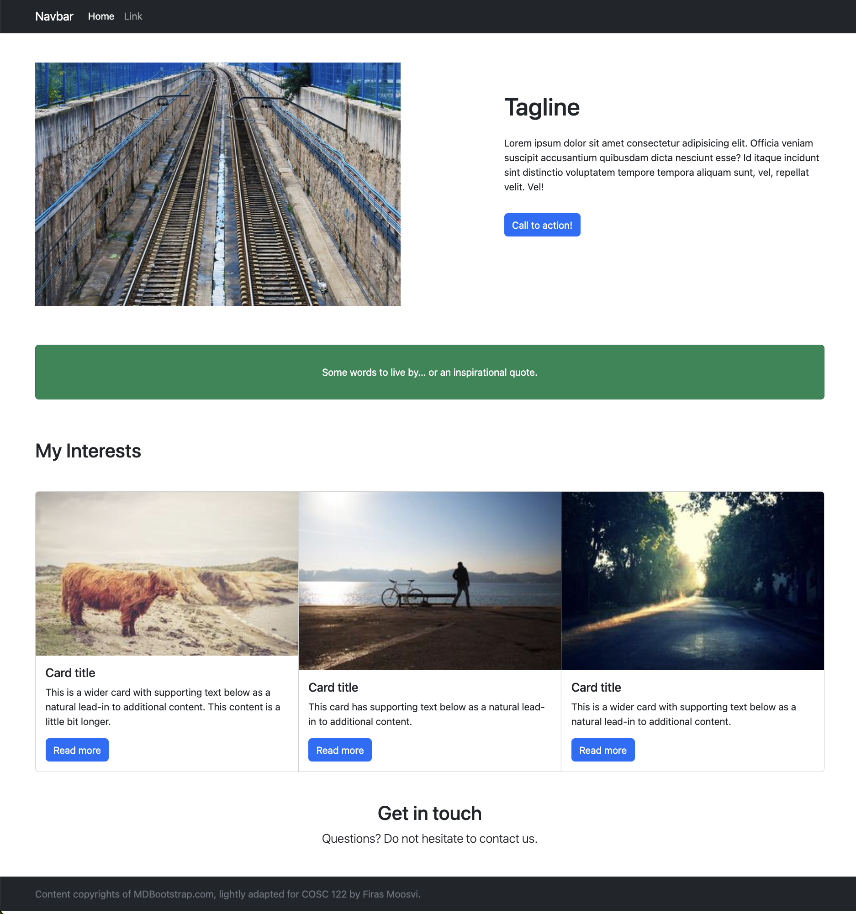
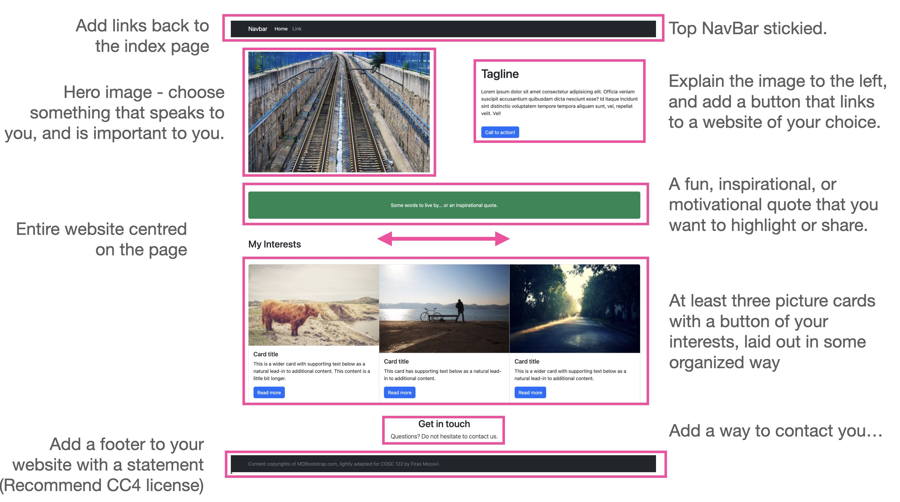

# Task 5

In Task 5, you will put it all together and make a fully functioning Bootstrap website!

If you'd like to watch the FreeCodeCamp instructor do something similar, go ahead and [watch this video (optional)](https://www.vibby.com/v/XJHghDnnT):

<iframe src="https://www.vibby.com/embed/vib?vib=XJHghDnnT" frameborder="0" scrolling="no" seamless="yes" style="overflow: hidden; width: 100%; max-width: 640px; height: 372px;" allowfullscreen=""></iframe>

Just remember that some of the JavaScript (search bar, dropdowns, responsive navbar) will not work yet because we haven't added the JavaScript to this website, so for our purposes I've removed those elements.

Here's what you need to do for this task:

- You will be doing everything in this task, in the [task5.html](task5/task5.html) file.
- The entire website should be centred on the page (hint: use Bootstrap grid).
- Top NavBar stickied.
- Add links back to the index page in the NavBar.
- Hero image: choose something that speaks to you, and is important to you.
- Explain the hero image you picked, and add a button that links to a website of your choice.
- A fun, inspirational, or motivational quote that you want to highlight or share, as a badge or as a card, spanning the full length of the page.
- At least three picture cards with a button of your interests, laid out in some organized way (hint: use another Bootstrap Grid), linking to other websites using buttons.
- Add a way to contact you (Optional).
- Add a footer to your website with a copyright statement and a Year.
    - I recommend a CC4 license, similar to this:
        - > All content on this site (unless otherwise specified) is licensed under the <a href="https://creativecommons.org/licenses/by-nc-sa/4.0/">CC BY-NC-SA 4.0 license</a>
    - You can of course, [choose any license](https://choosealicense.com) you like.

Here's roughly what we're expecting for this task (feel free to be creative and choose different colours and layouts):

Here is an annotated version of the screenshot above to point out some key features we will be looking for:

## Attribution

This lab (particularly Tasks 4 and 5) relies upon the excellent work by [FreeCodeCamp.org](https://freecodecamp.org) and in particular, [Dawid Adach](https://dawidadach.com/en/) founder of [MDBootstrap.com](http://MDbootstrap.com).

## Specifications

- Link to [task5.html](task5/task5.html) from your main `index.html` file.
- Follow all the specifications laid out above in Task 5.