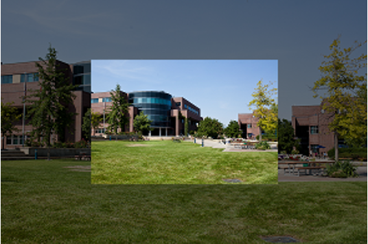

# Task 1 - Draw an Image

Find an image that you like and draw it on a new sketch.

Do the following:
  * Load image.
  * Set sketch size to image size and background to black. 
  * Set image mode to CENTER.
  * Set image opacity to  50%.
  * Draw image at the center of the sketch.
  * Set image opacity to 100%.
  * Draw the image again at the center but at 50% of its original size. 

## Embed a screenshot of your drawing

Embed the screenshot of your drawing (not the code) here using markdown syntax: