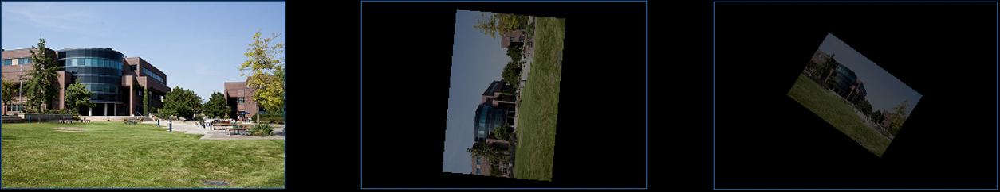

# Task 2 - Animate Image Transformation and Opacity

In the following exercises, use any image of your choice.

A) Animate the transparency of your image so that it appears as if it is fading out.

B) Animate the coordinates’ scale and rotation so that the image appears as if it is moving away (inwards) while rotating. 

## Embed an animated gif of your drawing

Embed the animated gif you created here using markdown syntax: