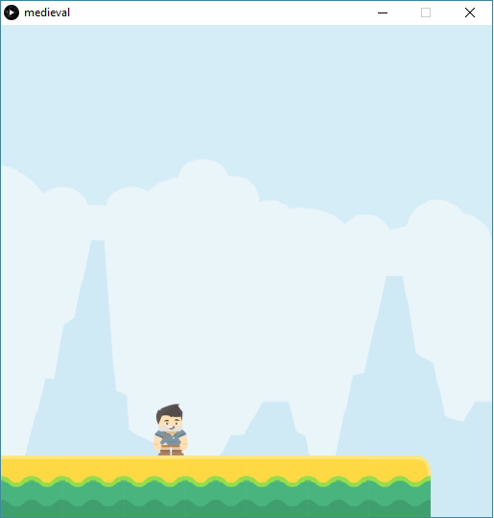

# Task 3 - Draw a Game Platform

In this exercise, we will build a game platform using a few tiles that can be used as “Lego pieces”.
 * All tiles have the same width & height (64 x 64)
 * Tiles need to be loaded into separate variables (e.g. img1, img2, …), and then placed one by one on the sketch

Steps:
 * Use the [starter code](./medieval_starter).
 * Open in Processing.
 * Write the missing code as per the instructions in starter code.
 * The output should be similar to: 
 
 

## Embed a screenshot of your drawing

Embed the screenshot of your drawing (not the code) here using markdown syntax: