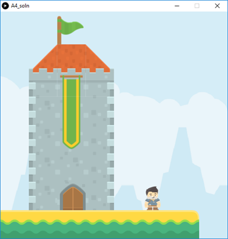

# Task 1: Create a Scene

In this lab, you are required to build a complex and creative platform.
- Go to [http://kenney.nl/assets](http://kenney.nl/assets). Familiarize yourself with the assets (tiles) available there. Make sure to read the copyright note before you download and use any of these assets (as of Feb 2018, assets on Kenney are free to download and use).
- To build _my_ platform below, I mainly used the following two packages from Kenney: 
    - Platformer Abstract ([download](./platformer_abstract))
    - Platformer Pack Medieval ([download](./platformer_medieval))
    - You will probably need to use these two packages. However, you also need to use additional packages in order to be creative with your design. 
- Put the tiles of your choice (based on your design) on the game sketch.
- As with the class exercise, your player character should still move horizontally with the mouse. 

Here is my design, but **your design should be different** (you can use the same tiles I used, but create a different platform. You can also use other tiles from other packages). 
Note: the “Platformer Pack Medieval” has a sample image with good ideas for different designs.

## Specifications

- We are expecting you to commit your work often (try to aim for a minimum of 3-5 commits per lab) with useful commit messages marking your progress.
- At least one _big_ building (e.g. the tower in my design)
- At least one flag (the one on top of the tower in my design)
- At least one banner flag (the long green and yellow one above the door in my design)
- At least one door or window
- A ground
- A player character that moves horizontally with the mouse.
- A background image (not a plain text)

## Embed a screenshot of your drawing

Embed the screenshot of your drawing (not the code) here using markdown syntax: