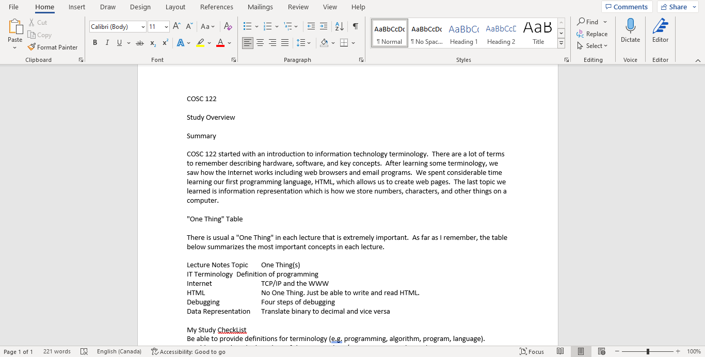
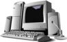
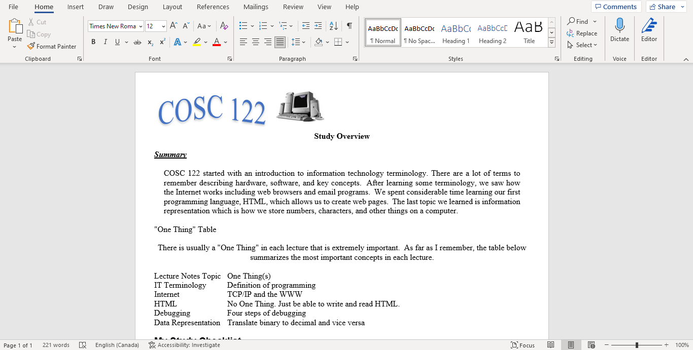
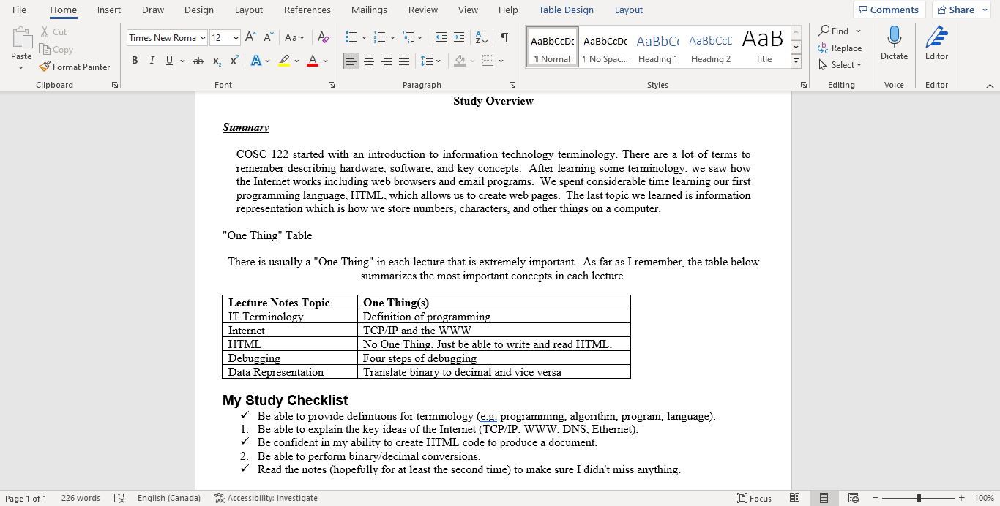
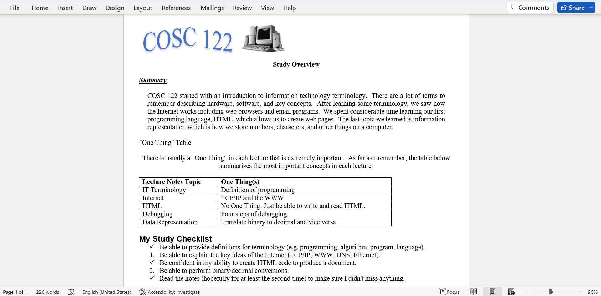

# Task 1 - Microsoft Word

In Task 1, you will use Microsoft Word to create a written document and practice using the functionality provided by a common word processor.

The file name should be "lab5_task1_[name].docx".
Replace `[name]` with your name in the file name.

## Introduction to Word Processing

**Word processing** is the creation of text documents using computer software.
At the beginning of this term, we taught you how to use Markdown, which is a plain-text language to prepare documents.
Despite the power and simplicity of Markdown, it has not yet widely accepted in the world, particularly the business world (and realistically, any world outside the computing world, at least at the time of this writing).
Currently, Microsoft Word is the most popular software for word proccessing, and that's what you'll be using in this lab.

## Basic Concepts

A word processor allows you to type and edit text, add images, lists, tables, and graphics.
You can organize how the text appears on the page by changing fonts, sizes, colors, indenting and margins.
The **cursor** is a blinking bar that represents your current edit location in the document.
Characters typed or deleted will be modified at the current cursor location.
Below is a screenshot showing Microsoft Word and some of its interface components.
There is also a table that summarizes common operations and how they are performed in Word.

### Common Operation Summary

| **Operation**                                    | **How to do it**                                                                                  | **Description**                                                                                                                                                                           |
|--------------------------------------------------|---------------------------------------------------------------------------------------------------|-------------------------------------------------------------------------------------------------------------------------------------------------------------------------------------------|
| Word wrap                                        | Done automatically for you                                                                        | Instead of pressing ENTER at the end of every line, Word automatically wraps words to next line.                                                                                          |
| **Do not press ENTER at the end of every line.** |                                                                                                   |                                                                                                                                                                                           |
| bold, italic, underline                          | Highlight text and click on button (B,I,U) located in the *Home* tab                              | Performs bold, underline, or italics.                                                                                                                                                     |
| paragraph alignment                              | Cursor on paragraph, click alignment button located in the *Home* tab                             | Left, center, right, or justify paragraph text                                                                                                                                            |
| Search and Replace                               | Within the *Home* tab click the *Editing* button with a binocular icon or **Ctrl+H**              | Find and replace text in document                                                                                                                                                         |
| Spell Check                                      | Within the *Review* tab, click the *Spelling & Grammar* button or **F7**                          | Check document for spelling and grammatical errors.                                                                                                                                       |
| Font size and type                               | Highlight text, click Font and Size drop-downs within the *Home* tab                              | Changes the font type and size of selected text.                                                                                                                                          |
| undo/redo                                        | **Ctrl+Z** (undo) and **Ctrl+Y** (redo) Note, it's , or the Command key on macOS instead of Ctrl | Undo a change made or redo a change previously made but later undone.                                                                                                                     |
| cut, copy, paste                                 | **Ctrl+X, Ctrl+C, Ctrl+V** Note, it's , or the Command key on macOS instead of Ctrl              | Cut removes text from document and puts into clipboard.  Copy puts text into clipboard but remains in document.  Paste puts text currently in clipboard at current cursor position. |

## Other Concepts

Here are a list of some more specialized concepts.

### Document Views

You can view a document from different perspectives using options in the **View** tab or next to the Zoom options at the bottom of the window.  Normally, you want to use **Print Layout View** which shows the document as it would be printed. If you wish to show the page rulers, check the *Ruler* option within the *Show/Hide* menu.

### Page Margins

The page margins can be changed from the *Page Layout* tab.  The margins menu offers a few preset options, as well as the ability to set Custom Margins in the *Page Setup* dialog

### Paragraph Spacing and Alignment

You can control the margins and line spacing of a paragraph by putting the cursor in the paragraph, performing a right-click, and selecting the **Paragraph...** option.
A screenshot is below.
In this dialog box, you can change the line spacing and paragraph margins (among other things).
Select the summary paragraph in our document and change its left and right indents to 0.5 cm. Notice how on the top ruler (if visible), the small triangles and squares have moved.
You could have changed the margins by moving these instead of using the dialog.
The upper-left triangle shows the start of the first line.
This is either referred to as the first line indent if the first line is indented more than the rest of the paragraph, or a **hanging indent** if the first line is indented less than the rest of the paragraph.
The triangle right below shows the start of the sentences besides the first.
You can move each triangle individually or move the square which will move them both at the same time.
Note the triangle on the right-side of the ruler that can be used to adjust the right margin of a paragraph.
The grey areas on the ruler represent the location of the non-printable margins.
Any headers or footers are placed in the upper and lower margins shown by these grey areas.

## Task 1.1 Initial Document

Here's what we are expecting for this task:

- Copy the text down below and paste it in the document such that it displays appropriately in the document.
- Fill in the blanks about the two most important things you learned in that week.

(Hint: Use the `Paste Special...` option, then change the before/after paragraph spacing, as well as the line spacing)

<PRE style='width: 90%; margin: 1ex; padding: 1ex; border: 1px solid #000; overflow: auto;'>
COSC 122

Study Overview

Summary

COSC 122 started with an introduction to information technology terminology and some tools like Markdown and VSCode.
There are a lot of terms to remember describing hardware, software, and key concepts.
After learning some terminology, we saw how the Internet works including web browsers and email programs.
We spent consideable time learning a programming language, HTML, which allows us to create web pages.
The last topic we learned is Bootstrap, which is a framework to make beautiful webpages quickly and painlessly.

"Two Things I Learned" Tabl

There is usal a "Two Things I Learned" in each lecture that is extremely important.
As far as I remeber, the table below summarizes the most important concepts in each lecture.

Lectur Notes Topic	& To Thigs I Learned

Couurse Seput | ___________________
Filesystems, Markdown, and Terminology | ___________________
HTML and Debugging | ___________________
Networking and the internet | ___________________
Spreadsheets, Microsoft Word, PowerPoint | ___________________

My Study CheckList
Be able to provide definitions for terminology (e.g. programming, algorithm, program, language).
Be able to explain the key ideas of the Internet (TCP/IP, WWW, DNS, Ethernet).
Be confident in my ability to create HTML code to produce a document.
Be able to perform binary/decimal conversions.
Read the notes (hopefully for at least the second time) to make sure I didn't miss anything.
</PRE>

 

Your content will look slightly different than the screenshots below, we expect you to come up with your own **brief** notes and highlights from the topics we've covered so far.

## Task 1.2 - Content Formatting

When creating a document, you will need to give structure to the content found within this one. Formatting allows you to arrange text appropriately, highlight important information and more. 

Here's what we are expecting for this task:

- Change the page margins to 1cm on all sides.

- Change the font of the document to Times New Roman size 12.

- Change the font of "My Study CheckList" to Arial size 14 and bold.

- Make "Summary" italicized, bold and underlined and "Study Overview" bold and centered aligned. 

- Make the first paragraph justify aligned and indent it by 0.5cm on both the left and right.

- Make the "Two Things I Learned" table into a proper Table in Microsoft Word, center align everything in the table cells.

## Task 1.3 - Spell Checking

Although the spelling and grammar checking features are very good, there are still issues you should be aware of.
First, not all words, especially scientific and proper names are in the dictionary. 

These terms may appear to be incorrect (wavy red line below them) when in fact they are correct.
Another common error that is frequently missed is a word that is spelled correctly but is an incorrect word as required in the sentence.
An example is: "**Are** sentence is correct.".
This probably should be "**Our** sentence is correct."

Here's what you need to do for this task:

- Find and correct spelling and grammatical errors in the document (read the document carefully).

## Task 1.4 - WordArt and Images

To add WordArt to a document, select the "Insert" tab and click the *Word Art* button: .
If you highlight text before selecting from the menu, that text will be converted into WordArt.

Similarly to WordArt, to add an image to a document, select the "Insert" tab, click the "Pictures" button and then select from where you are getting this image from.

Here's what you need to do for this task:

- Make "COSC122" into WordArt. Note that you do not need to match the image exactly. Show us that you know how to create and style WordArt.

- Add the following image  (or another small image of your liking) next to the COSC122 WordArt.

## Task 1.5 - Lists

List are one of the most commonly used features of word processors. They allow you to structure information that is related, gives levels of importance, or simply summarize content easily.

Here's what you need to do for this task:

- Make three "My Study Checklist" elements into a checklist (you may need to define a new bullet symbol) and two elements into a numbered list.

## Task 1.6 - Tables

To create a table, select the "Insert" tab and click the "Table" button. You can create a table by highlighting the number of rows and columns you would like the table to have, or by selecting the "Insert Table..." option. 
You can create a table out of our existing items by highlighting them before selecting "Insert Table...", but you will have to format the table yourself as the auto-table creation does not work perfectly.

Here's what you need to do for this task:

- Make a table containing all the elements of the "One Thing".

## Task 2.5 - Saving your file

And you are almost done!

Here's what you need to do for this task:

- After you have completed the task, you will need to add your Word document into the repository, you can do this by dragging and dropping the file into the VS Code Explorer window. Remember to commit your changes.
    - Note that you because a `.docx` is a "binary" file, it doesn't have the same advantages of a live preview in VS Code, and line-by-line comparisons like a plain text code file. This will also be the case for `.pptx`, and `.xlsx` files.
- **You will also need to create a Markdown file called `lab5_activity.md` and display a screenshot of your finished document in it.**
    - You will also use the same file for a screenshot of your document from Task 2.
    - Make sure to add a heading before your image, so that we know this is Task 1.
    - Add a relative link to your file using the Markdown link syntax in `lab5_activity.md`.

Here's roughly what your final product should look like:

## Specifications

- Correctly display and format the content as described in Tasks 1.1 and Task 1.2
- Correct any spelling or grammatical mistakes found in the document, as described in Task 1.3.
- Add a WordArt and an image to the document, as described in Task 1.4.
- Display a checklist and a table in the document, as described in Task 1.5.
- Add your completed document in your repository, take a screenshot, and embed the screenshot of your final word file in a Markdown file in this repository called `lab5_activity.md`.