# Task 2 - Microsoft PowerPoint

In Task 2, we will provide you with screenshots of a PowerPoint presentation that does not meet ideal presentation design considerations. 

For this task, you will read the presentation design issues list and correct the presentation according to them.

Note that for Task 2, some presentation design issues will be **general** while other will be **slide specific**. Make sure to address all the design problems.

The file name should be "lab5_task2_[name].pptx".
Replace `[name]` with your name in the file name.
Also Put your name on the first slide (to the left of the course name separated by a hyphen).

## Readings

This section contains content you should read and understand.
You are responsible for practising the skills and features on your own.

### Electronic Presentations

**Presentation software** such as Microsoft PowerPoint makes it easier to create and display information during presentations.
Using Microsoft PowerPoint is very similar to Microsoft Word except the goal is to produce a result that looks good and is useful for presenting to larger audiences simultaneously, rather than simply conveying information in text form.

### Slide Layouts

A **slide layout** is how the slide appears on the screen.  Most of the time the slide has a title bar and one large text area.  However, other slide layouts have a two-column text area or some combination of text areas, images, and tables.  Our third slide will have an image on the left side and a text area on the right side.  Create a new slide with placeholders for two pieces of content.  If you have created the slide without the correct layout, you can adjust it by right-clicking on the slide, and selecting the *layout* option.

**TASK: Create a new slide.  Make this third slide have the "Two Content" layout.**

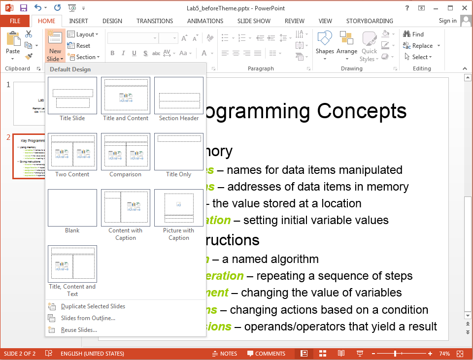

### Adding an Image

Download an image by <A HREF="ubco-W2022T1-cosc122/template_lab05/images/beach.jpeg">clicking on this link</A>.  Save the image to your directory.  We will add the image on the left side of slide #3.  Click on the picture icon in the left content placeholder and find the file that you just saved.  Alternately, you can add an image by selecting the **view** tab.  Complete the slide by adding text as shown below.

**TASK: Add image and text to third slide.**

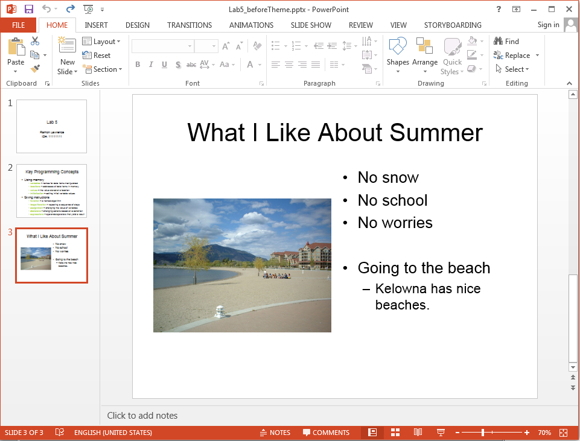

### Changing Slide Designs

To change the design for all slides, select the **Design** tab and pick a design.  We will pick the design called **Clouds**.   
You can download it by <a href="clouds.thmx">clicking here</a>, if it is not available by default. 

**TASK: Change the slide design to clouds.**

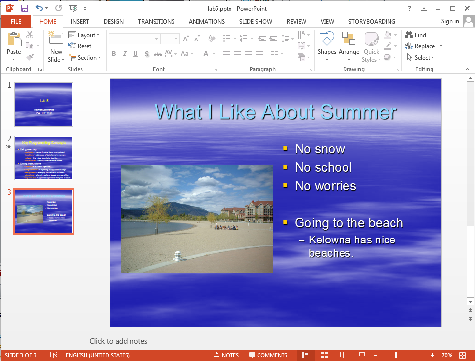

### Changing the Master Slide

The master slide contains the template for all slides.  (There are actually separate master layouts for slides, notes, and handouts.)  To view and change the slide master, under the **View** tab, select the **Slide Master** button.  Any changes you make to the master slide are made to all slides in your presentation.  (It is possible to make individual slides not follow the master layout)  The light blue title text is hard to read on the clouds background.  Change the colour of the title text to yellow on the master slide.  Note how that change is made on all slides in the presentation.  The master slide is also where you would put headers, footers, background images, and page numbers.

**TASK: Change the colour of the title text on the master slide to yellow.**

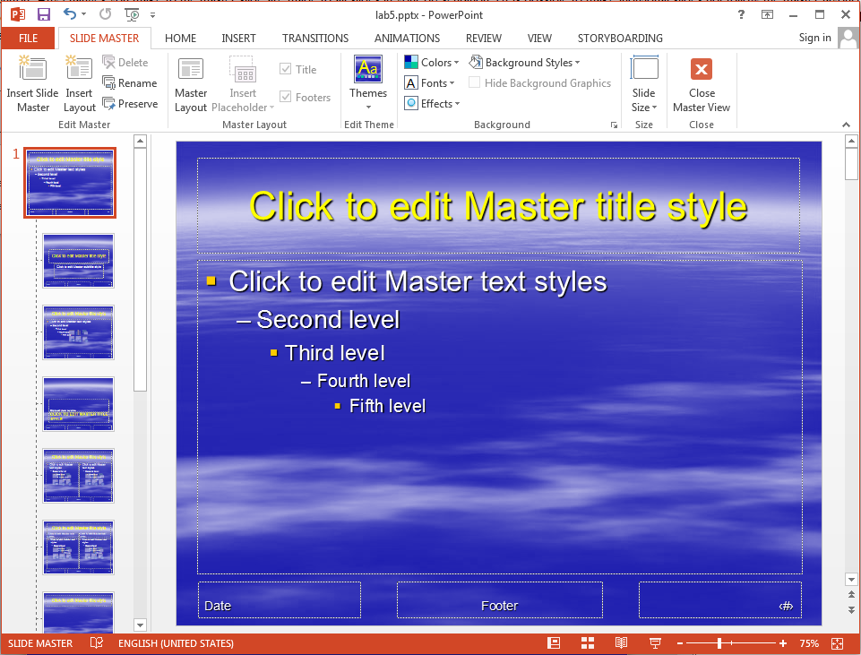

### Transitions and Animations

A **slide transition** is a special action performed when you change slides during a presentation.
Examples of slide transitions include wipe down, fade, and dissolve.
You can add a slide transition by going to the **Transitions** tab, and selecting the **Dissolve** transition from the gallery.
A slide **animation** is used to move around images or text on a slide (whereas a slide transition was performed when changing between slides).
To create a slide animation, go to the **Animations** tab.
Select the **Entrance Effect** called **Fly In**, click **Animation Pane**.
In a bulleted list, you can set certain list items to **Start on Click** using the dropdown menu that appears when you click on the item in the list, and every other item **Start With Previous**.

#### Dissolve Transition

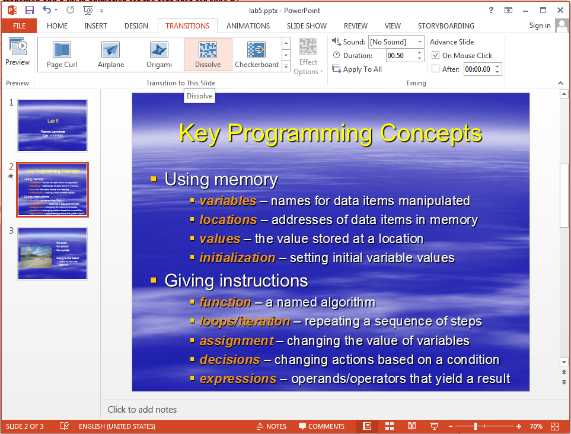

#### Text Animation

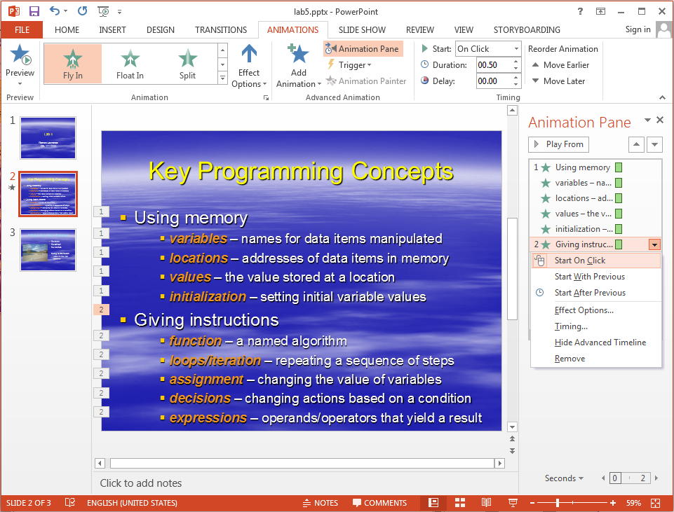

### Playing a Slide Show

To play a slide show you can:
	
- In the **Slide Show** tab, click the **From Beginning** button
- Click the **Slide Show** button available at the bottom of the window next to the zoom options or within the view tab
- Press **F5** on your keyboard

### Important Presentation Considerations

The most important challenge when developing a presentation is to make the information concise and to the point without losing the key facts that must be conveyed.
The second important challenge is to chose fonts, colours, and display formatting that makes it easy for the viewers to grasp the information being presented.

## Common presentation design issues

- Be clear and brief in your discussion but not too brief. Point form is okay instead of full sentences.
- Use a consistent theme for all slides. Theme includes background colour, text colour, font, etc.
- Use images, charts, and tables to make information easier to grasp.
- Use good slide titles that summarize the content of the slides.
- Use no more than 5-7 bullets per slide.
- Use large (18-24 point for text, 40-60 point for headings) font.
- Be aware of colour issues. Too much colour is distracting.
- Be careful when choosing a text and background colour. Make sure text is easy to read.

## PowerPoint Presentation To Fix

### Slide 1

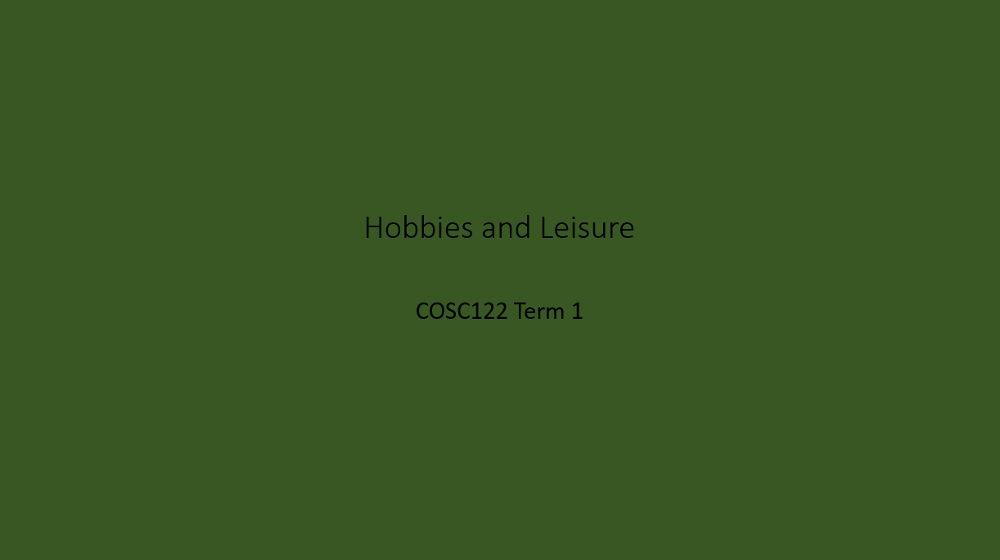

### Slide 2

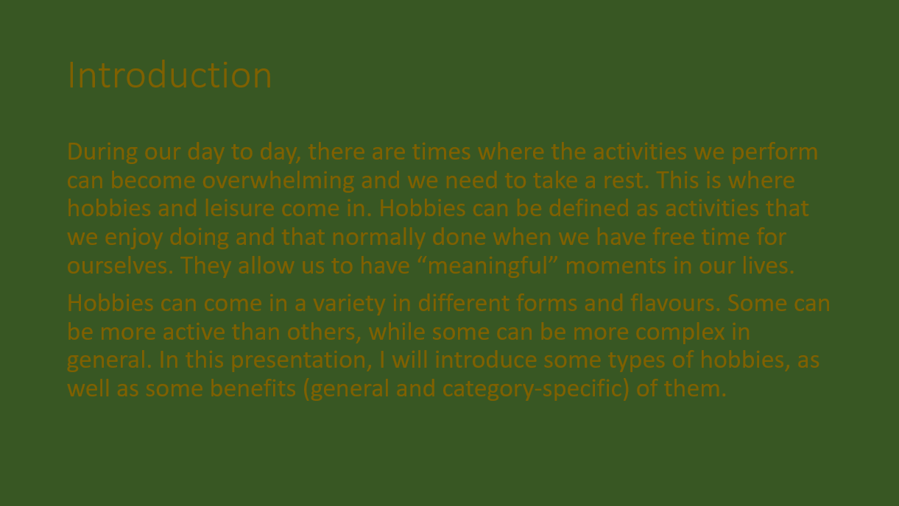

### Slide 3

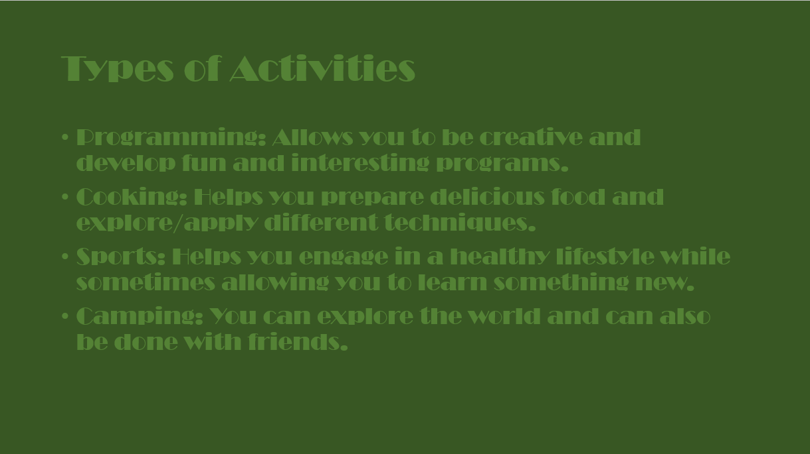

### Slide 4

 

Image Link: https://www.pexels.com/photo/selective-focus-photography-of-paintbrush-near-paint-pallet-1047540/

### Slide 5

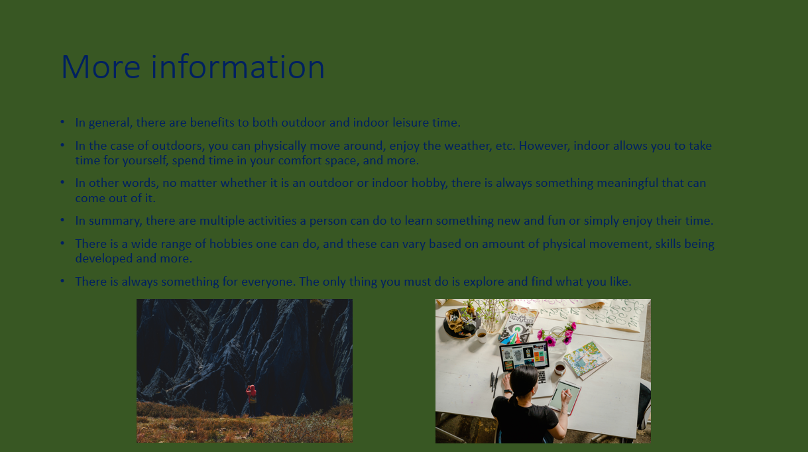 

Links to Images:

- https://www.pexels.com/photo/person-taking-photo-of-a-mountain-3069188/
- https://www.pexels.com/photo/photo-of-woman-writing-on-tablet-computer-while-using-laptop-4348401/

## Task 2.1 - Layout and Formatting

In presentations, layout and formatting allow speakers to provide content in a way that allows readers to grasp the concepts being discussed and make connections to the overall topic.
If the presentation's structure creates confusion to the viewer, conflicts with the flow of the presentation or more, changes need to be made according to presentation design issues.

Here's what you need to do for this task:

- Increase the font size on the slides where text does not follow appropriate design ideals.
- In slide 2, separate the paragraphs into bullet point form based on topic discussed.
- Divide the content of slide 5 into different slides based on theme. Give an appropriate title to each one. 
- Separate the images of slide 5 into the new slides and change the layout of the new slides to accommodate the images.

## Task 2.2 - Presentation Styling

Styling allows speakers to connect the content with the presentation as a whole. Whether that be the font used, colour palette decisions or more, it is important to make sure that the presentation is in tune with the theme to create an engaging discussion.

Here's what you need to do for this task:

- Change the background colour of the slides, to make the text readable.
- Change the font of the content so that it is consistent across the slides.
- Change the font colour where the text is difficult to read.

## Task 2.3 - Animations and Transitions

Transitions and animations are a good way of giving "life" to your presentation, allow you to catch the viewer's attention and make the presentation engaging. However, they can also become distracting and confusing to your viewer if used excessively or in the wrong context. 

It is a good rule of thumb to use transitions and animations at a minimum and, if you are using them, use only when preparing your viewer for the content (i.e. guiding the presentation).

Here's what you need to do for this task:

- Change the initial and end transitions of slide 4 to `subtle` transition types and reduce the duration by 5ms.
- Choose one animation and apply it to all the content of slide 4. Note that animation should happen at the same time for all elements.
- Add a transition to the beginning and end of the presentation. The transitions must match the theme of the presentation.

## Task 2.4 - Images and Citations

While using content that has being created, produced, written, etc by someone else (and that is allowed for use by others), it is essential to give credit to the original author. 

Here's what you need to do for this task:

- Choose images that explains the contents of slide 3 and add them to the slide. You can use <a href="https://www.pexels.com/">Pexels</a> or <a href="https://pixabay.com/">Pixabay</a>. You may need to change the layout of the slide to add the images.

- Give credit for the images that do not cite the author (hint: use the following format: Photo by `name` (*link to their website*)).

## Task 2.5 - Saving your file

And you are almost done!

Here's what you need to do for this task:

- After you have updated (and fixed) the presentation, you will need to drag and drop the PowerPoint document into the repository.
- You will also need to take a screenshot of your PowerPoint slides in "6 to a page" format and add them to the Markdown file created in Task 1 called `lab5_activity.md`.
- Make sure to add a heading to indicate which task it is. 
- Add a relative link to your file using the Markdown link syntax in `lab5_activity.md`.

- To create a screenshot of the slides, you will need to follow the following steps:
    - Click to the "File" tab in the document navigation bar.
    - Click to the "Print" option
    - In the "Settings" options, click on the `Full Page Slides`. 
    - A drop-down will appear. From the "Handouts" options, select `6. Slides Horizontal`.
    - Create a PDF of the Slides "6 to a page" and then take a screenshot of the preview on the right and add the save image into the Markdown document.

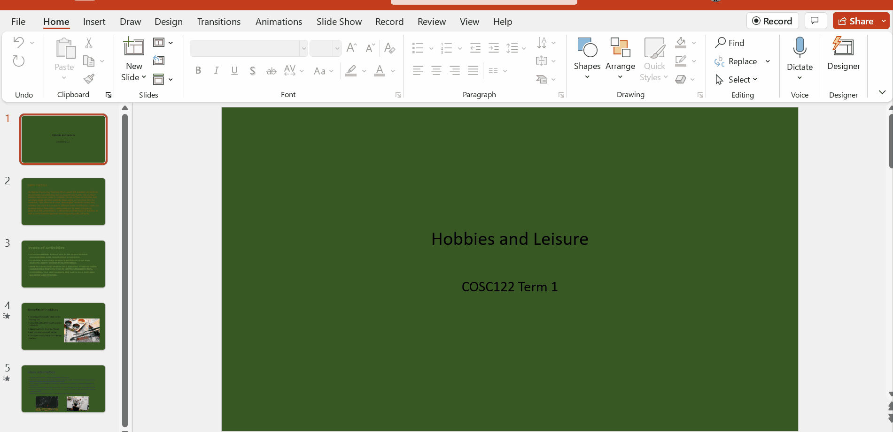

## Specifications

- Read the design principles presented in the introduction of Task 2's prompt.
- Update the presentation based on each subtask's points and design ideals.
- Save your updated presentation in your repository and display a screenshot of the slides in the Markdown file called `lab5_activity.md`.