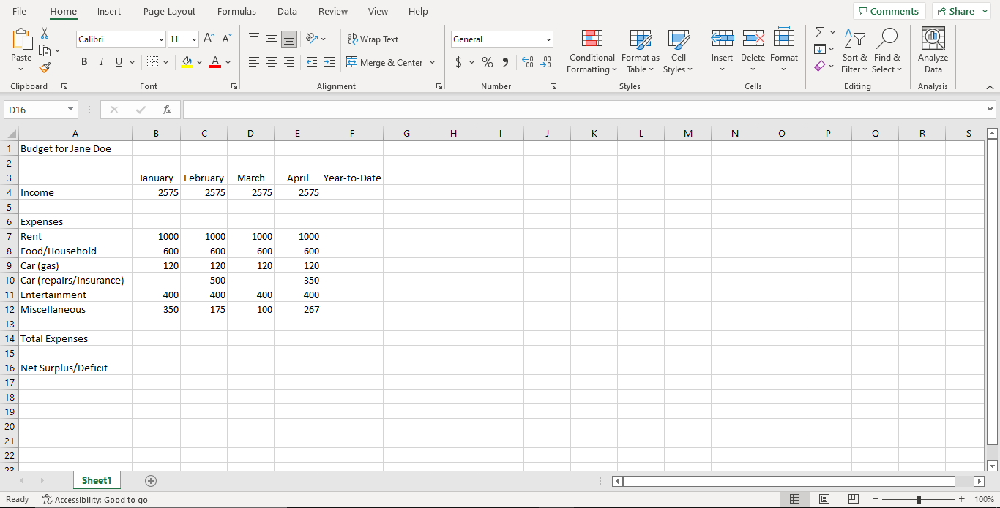
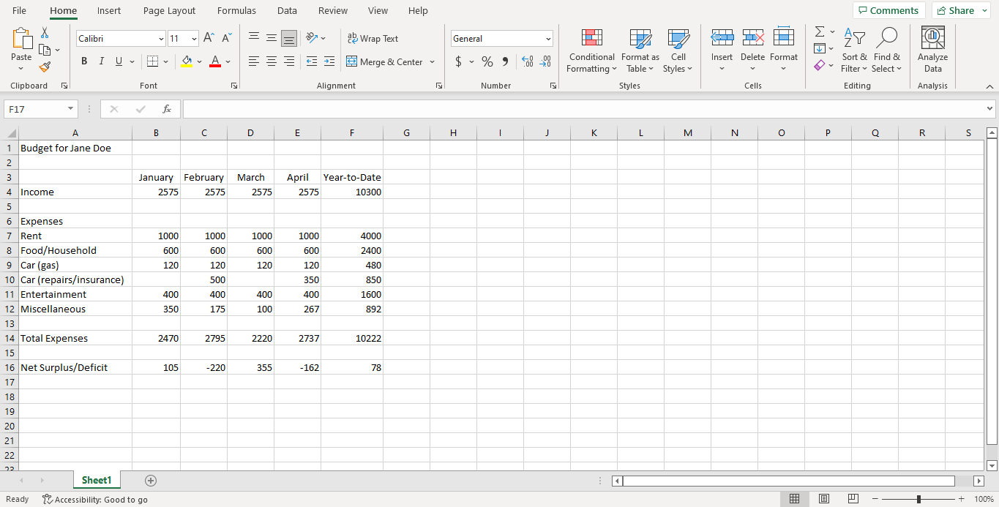
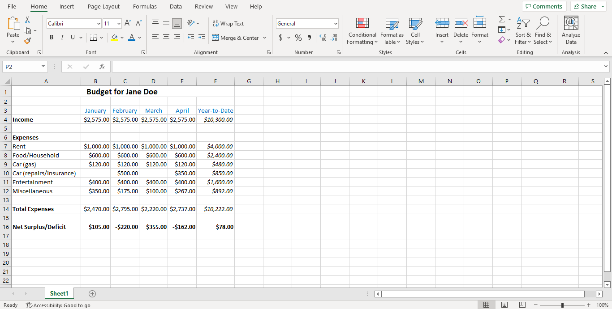
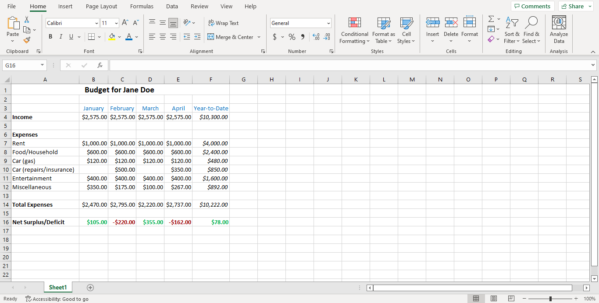
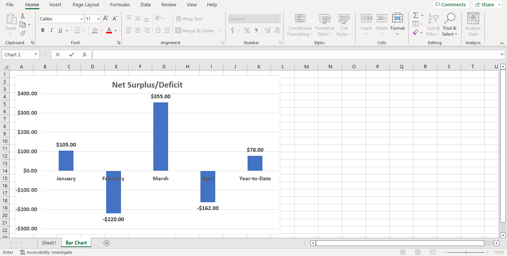
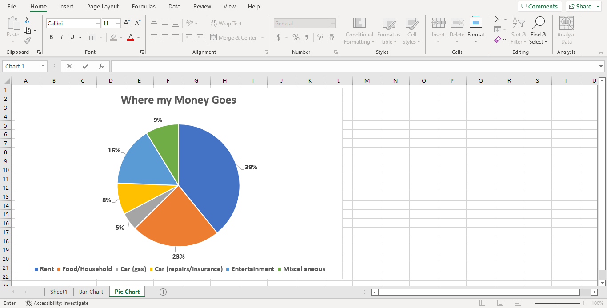

# Task 3 - Spreadsheets using Microsoft Excel

In this lab, you will use Microsoft Excel to produce spreadsheets.

You will do everything in a Excel document that you will name "task3_lab06_[name].xls". Put your name instead of the square brackets in the file name.

## Spreadsheets

A **spreadsheet** organizes information into a two-dimensional array of cells (a table).
Each **cell** has a row number and column label which combine to represent its address.
A cell location can store a number, text, or formula.
The power of a spreadsheet is that we can write simple formulas (commands) to perform calculations and immediately see results of those calculations.
Spreadsheets are very common in accounting and reporting applications.

### Tips for working with Spreadsheets

- On macOS The **Ctrl** key should be replaced by the Command or  key, some of the shortcuts on macOS are different and a nice table of shortcuts for both Windows and macOS [can be found here](https://corporatefinanceinstitute.com/resources/excel/shortcuts/excel-shortcuts-pc-mac/)
- Column width can be auto-adjusted to fit maximum column width by double clicking on the line between two columns.
- Using filling will automatically fill in days of week and months of year appropriately.
- To see all spreadsheet formulas, press **Ctrl** and **~** at same time.  Press **Ctrl** and **~** to go back to the normal view.
- Pressing the **Ctrl** and **Home** keys at same time will select cell A1.

## Task 1.1 - Data Entry

Data entry can be performed by typing or copying/cutting/pasting data into a cell or formula bar. The data entered may be a text label, a value, or a formula.

Here's what you need to do for this task:

- Copy the following data into your Excel document, this will hopefully get you familiar with manual data entry methods

## Task 1.2 - Using Formulas

Formulas are any expressions that begin with an equal sign ("=").
The equal sign indicates to the spreadsheet that a calculation must be performed to compute the value of the cell.
An aggregate formula computes a summary function over a range of cells.
The values can either be literals or cell locations. 

Here's what you need to do for this task:

- Calculate the total values for each cell of the "Year-to-Date" column, and the "Total Expenses" row.

- Calculate the "Net Surplus/Deficit" values for each month and for "Year-to-Date" based on income and total expenses.

Here's roughly what we're expecting for this task:

## Task 1.3 - Standard Formatting

Standard formatting consists of changing font types and sizes, colors, bold, italic, underline, etc., and can be performed like in a word processor using similar menu items and command buttons.
It is also possible to format cells by selecting them and then selecting the "Format" menu option, then "Format Cells..."

Here's what you need to do for this task:

- Merge the cells in row A so that the title is centered to the data table. 
- Increase the title's font size to 14pt.
- Change the number type of the values from `General` to `Currency`.
- Change the font colour of the month/year-to-date row to blue.
- Make the title, "Income", "Expenses", "Total Expenses", "Net Surplus/Deficit" bold.
- Make the "Net Surplus/Deficit" values to bold and the "Year-to-Date" values italic.

Here's roughly what we're expecting for this task:

## Task 1.4 - Conditional Formatting

Conditional formatting allows you to change the cell format based on data values.

Here's what you need to do for this task:

- Make the "Net Surplus/Deficit" values red if negative, and green if positive using conditional formatting.

Here's roughly what we're expecting for this task:

## Task 1.5 - Developing Charts

A chart is a graphical representation of spreadsheet data. A chart is of a particular type (line, bar, etc.) and requires the user to supply data that will be displayed in the chart.

Here's what you need to do for this task:

- Create a cluster column chart on a new sheet called "Bar Chart" based on "Net Surplus/Deficit" values per month/year-to-date.
    - Format the axes values and numbers as bold 12pt, and the title as bolded 20pt.
- Create a pie chart on a new sheet called Pie Chart based on "Expenses" types and "Year-to-Date" values. 
    - Format the values to display as percentages and bolded 12pt.
    - Format the legend as bolded 12pt, and title as bolded 20pt.

Here's roughly what we're expecting for this task:

Bar Chart:

Pie Chart:

## Task 1.6 - Saving your file

And you are almost done!

Here's what you need to do for this task:

- After you have finished the previous tasks, you will need to drag and drop the Excel document into your repository.
- **You will also need to take screenshots of the excel spreadsheet as well as the two charts and display them in the Markdown file: `lab5_activity.md`.**
- Make sure to add headings describing what each screenshot shows.

## Specifications

- Create a spreadsheet and correctly display the data in it.
- Use formulas to calculate the total and "Net Surplus/Deficit" values as described in Task 1.2.
- Format the spreadsheet as described in Task 1.3 and Task 1.4.
- Create two charts as described in Task 1.5.
- Save your document into the repository and display and format the screenshots in a Markdown file as described in Task 1.6.