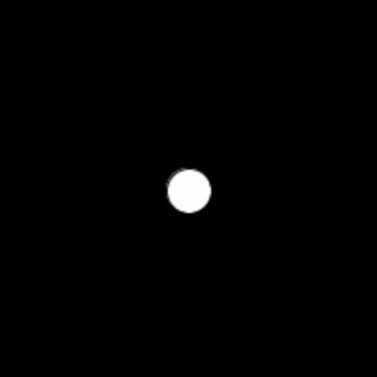

# Task 3 - The *map()* function

Using the map() function, draw a circle that follows the mouse cursor "to some extent"

## Specifications

- To do this, you need to map:
  * mouseX to from range (0 to window width) to range (25% to 75% of the width), and
  * mouseY from range (0 to window height) to the range (25% to 75% of the height).

## Embed an animated gif of your drawing
 
Embed the animated gif you created here using markdown syntax: