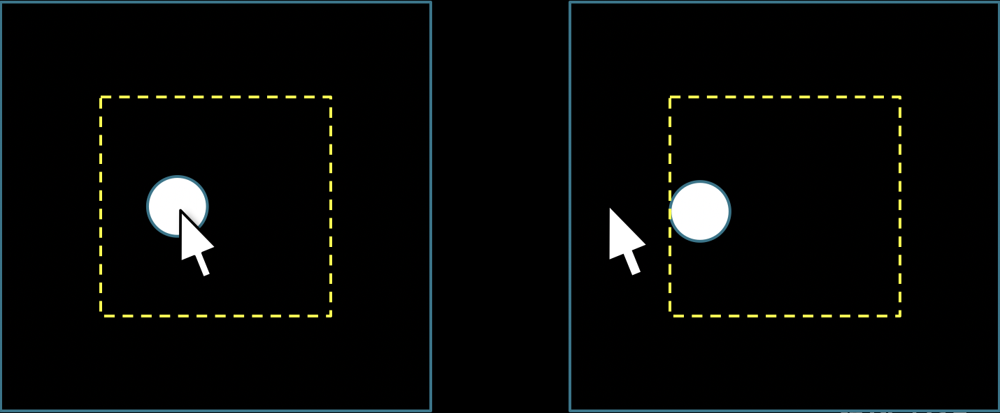

# Task 4 - The *constrain()* function

In this task you will work with the `constrain()` function.

## Specifications

- Repeat Task 3 but with the ball exactly following the mouse cursor as long as the mouse is within the dotted box (below).
- The ball cannot follow the mouse outside the box.
  * To do this, replace the map() function with a constrain() function.
  * (you do not need to draw the dotted box)
  

## Embed an animated gif of your drawing
 
Embed the animated gif you created here using markdown syntax:
