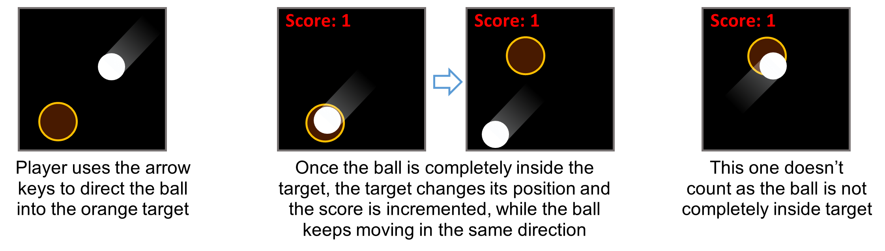

# Task 1: Aim-for-Target Game

In class, we looked at a very simple animation of a ball bouncing off the edges of a sketch.
In this question, we will turn this animation into a simple game where the player tries to score by directing the bouncing ball into a target circle.
To make the game challenging, the target is designed to be just a little bigger than the ball. 

## Specifications

- We are expecting you to commit your work often (try to aim for a minimum of 3-5 commits per lab) with useful commit messages marking your progress.
- There is some starter code provided to you in [task1/q1.pde](task1/q1.pde). You should update this code.
- The player should use the arrow keys to slightly modify the direction of the ball.
- Whenever the ball is completely inside the target, the score is incremented and the target moves to a new random location.
- The ball should bounce off the edges.
- Check if the ball is inside the target and taking the appropriate action if it does.
- Reacting to key presses.

**Optional** To challenge yourslef, replace the ball with an image and make any necessary changes (e.g. changing the target to a square if the shape in the image is a square).

## Embed an animated gif of your drawing
 
Embed the animated gif you created here using markdown syntax:
