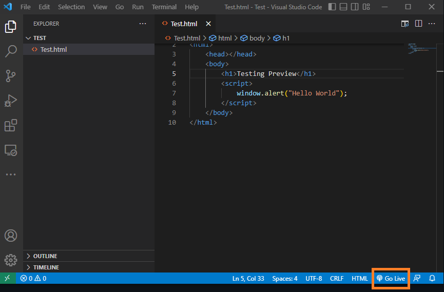

# Task 1

## Install the Git software on your computer

You will need to install one piece of software on your computer.
This is important for you for Lab 6 onwards and only needs to be done once.
There are separate instructions for Windows and for macOS, you only need to follow the one for your operating system.

### Git for Windows

[Click this link](https://github.com/git-for-windows/git/releases/download/v2.38.1.windows.1/Git-2.38.1-32-bit.exe) to download Git for windows.
Follow the prompts and click through the defaults (there are a bunch of options, all the defaults are fine).

If you know you have a 64-bit machine, you can [use this link instead](https://github.com/git-for-windows/git/releases/download/v2.38.1.windows.1/Git-2.38.1-64-bit.exe), though the one above will work just fine as well.

### Git for macOS

Activate Spotlight (+Space) and type in "Terminal" to open the Terminal application on your Mac.


Once it's open, type the following command to install Xcode command line tools:

```
xcode-select --install
```

You should see the following dialog box, click Install to continue and follow the prompts:


After installation, in Terminal type the following to ask for the version:

```
git --version
```

you should see something like this (does not have to be the exact same version) if you were successful:

```
git version 2.37.2
```

**Important: If you run into trouble, this is the time to post on {{ FORUM_LINK }} with your error message and ask for help!**

## Clone your repository locally

Here are the steps to clone your repository (after you have installed Git on your computer):

- Open your lab06 remote repository on VS Code on your computer using the "GitHub (`><`)" button on the bottom left of your VS Code window, then clicking "Open Remote Repository", then click "Open Repository from GitHub" and search for your lab06 repository.
- Then click on the "Github (`><`)"  and click "Continue Working On..."
- Then select "Clone Repository Locally and Open on Desktop..."
- Create a folder named "COSC122" in your computer where you will keep the rest of your labs.
- Choose the "COSC122" folder and click "Select Repository Location"
- An alert asking you if you would like to open the cloned repository will pop-up. Click "Open", you may need to click "Trust" to allow all features to be enabled.

Here is an animated gif of all the steps:


After you have cloned the repository, your VS Code (on your computer) should look like this:


Once you've cloned your repo, you're ready to move on!

## Introduction to "Show in Browser" and LiveServer

In previous labs, you learned how to use "HTML Preview" in VS Code to view the changes you made to your webpages in real time.
However, when JavaScript is added into HTML files, "HTML Preview" will not allow you to see the content being added to the file.

We will show you two options that you can use to view the output of your JavaScript code on a browser.

### Live Server Extension

"Live Server" is a VS Code extension which is used to view changes that you make to your webpages by creating a local development server so you can test out your JavaScript code.

- Similarly to installing "HTML Preview", you will need to head to Extensions marketplace and install "Live Server" by Ritwick Dey ([Thanks to Sebi](https://edstem.org/us/courses/23523/discussion/1928726) for the Ed Discussion Post about this extension!) 

Here's what it looks like:


- If you are on a HTML file, once you click the "Go Live" button, a new tab will open up on your browser, displaying the contents of your file.



- If you make changes to your file and save these changes, the tab showing your webpage will reload and display the new content. 

- To close Live Server, you will need to click the button that is displayed in the same location that the "Go Live" button was in. Make sure to always close the connection once you are done working on your file.

### "Show in Browser"

"Show in Browser" is a built-in option in VS Code that allows you to open HTML files in the browser of your choosing.

- To access it, you will need to right-click on the HTML file you want to preview and select the "Show in Browser" option.


- Once you click this option, a new tab will open on the browser of your choice, displaying the contents of the HTML file.

- If you make changes to your file, to preview the changes, you will need to save your file and then reload the tab displaying the content of the HTML file.

## Specifications

Task 1 will not be not be explicitly graded. However, the content presented in this task will be required to complete the tasks onwards.