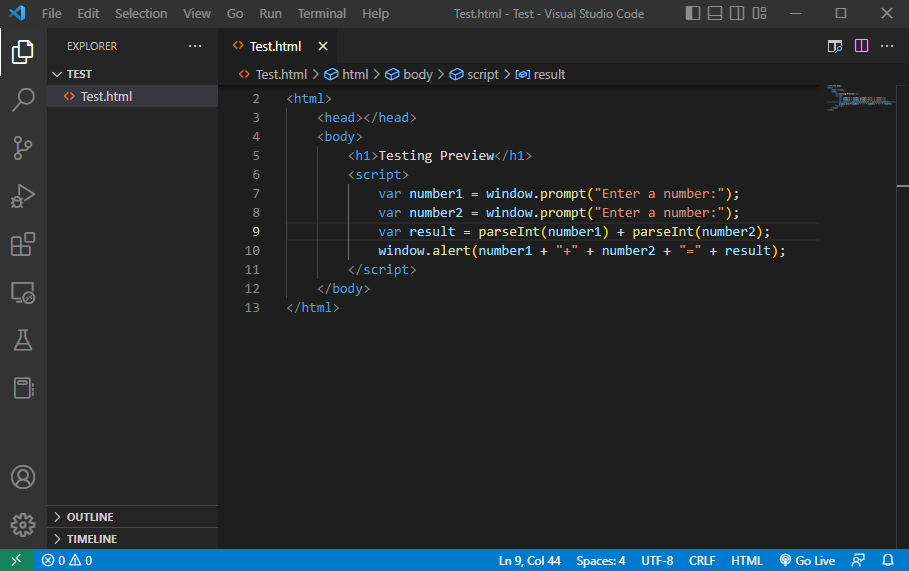
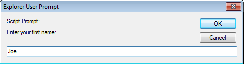
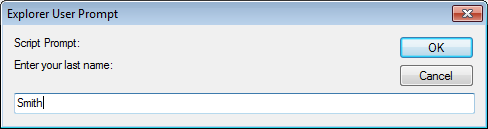
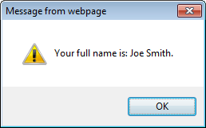

# Task 2

Once you have cloned your repository locally on your computer, you are ready to develop your first program using Javascript and some of the elements introduced in the course content.

## Readings: Useful JavaScript methods

### ParseInt() and Prompts

As practice, let's consider how we could create a program that does these things:

1. Asks the user for a number with a pop-up prompt screen.
1. Asks the user for a second number with a pop-up prompt screen.
1. Adds the first number and second number together to produce a result.
1. Displays the result to the user in an alert window.

Think about how you would solve the problem for a minute.
Try to write the code yourself. Did your code solve the problem?
Most likely, you were close, but when you used "+" JavaScript performed string concatenation instead of number addition.
It did that because the `window.prompt()` method returns strings even when the strings actually look like numbers.
What you need to know is a method called `parseInt()` that will convert a string (*str*) into a number. See the answer below:

<pre>var number1 = window.prompt("Enter a number:");
var number2 = window.prompt("Enter a number:");
var result = parseInt(number1)+parseInt(number2);
window.alert(number1+"+"+number2+"="+result);
</pre>

A screenshot is below.

## Task 2.1 - String Input

User input is an essential part of websites. It can allow you to personalize the user experience, as well as get feedback from the user when necessary. Depending on the language you are using, user input can have different forms. In JavaScript, you can get user input through prompts.

Here's what you need to do for this task: 

- You will do everything in this task, in the <a href="task2/task2.html">task2.html</a> file.

- Add a comment in the JavaScript code with your name and student number. 

- Create two distinct prompts where:

    - The first one asks the user to enter their first name.

    

    - The second one asks the user to enter their last name.

    

## Task 2.2 - Using User Input

After getting the input from the user, you must make good use of it to improve their experience with your website.

Here's what you need to do for this task:

- Based on the user input from the previous task, perform string concatenation to combine their first and last names into a full name.

- Displays the user's full name in an alert window.

## Specifications

- Read the contents of the entire Task and understand the differences between "Show in Browser" and LiveServer extension.

- Be able to explain what `ParseInt()` does, and how it is used in the context of prompts.

- Add a comment with your full name and student number 

- Display two prompts asking for the appropriate input as described in Task 1.1

- Use concatenation to combine the input from the prompts

- Display an alert as described in Task 2.2