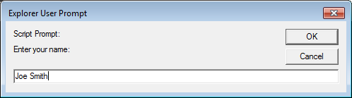
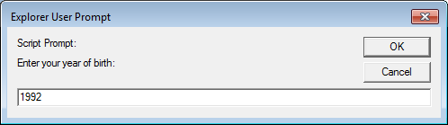
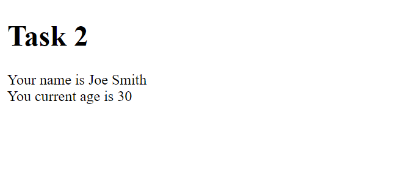

# Task 3

User input can take many forms, from strings to numerical values. In this task, you will learn how to make use of numerical input from the user, similar to Task2.

## Task 3.1 - Numerical Input

Here's what you need to do for this task:

- Similarly to Task2, you will do everything in <a href="task3/task3.html">task3.html</a>

- Add a comment with your full name and student number.

- Ask the user for their name with a pop-up prompt screen.



- Ask the user for their birth year with a pop-up prompt screen.



## Task 3.2 - Using numerical input

There are multiple ways you can use numerical input through JavaScript. For this task, you will need to use the getFullYear() method.

The getFullYear() method allows you to get the full year of a date of your choosing (this can be the current year or another year). In order to current year, you will need to the following block of code:

```
var d = new Date();
var year = d.getFullYear();
```

Here's what you need to do:

-  Determine the age of the user given the user input and the code above.

## Task 3.3 - Printing Input

Here's what you need to do for this task:

- Write the name of user and their age into the document.

Here's roughly what we are expecting of you:



## Specifications

- Add a comment with your fill name and student number.
- Get the user input as described in Task 3.2
- Get the age from the user from the code provided and their input.
- Print the results into the document.