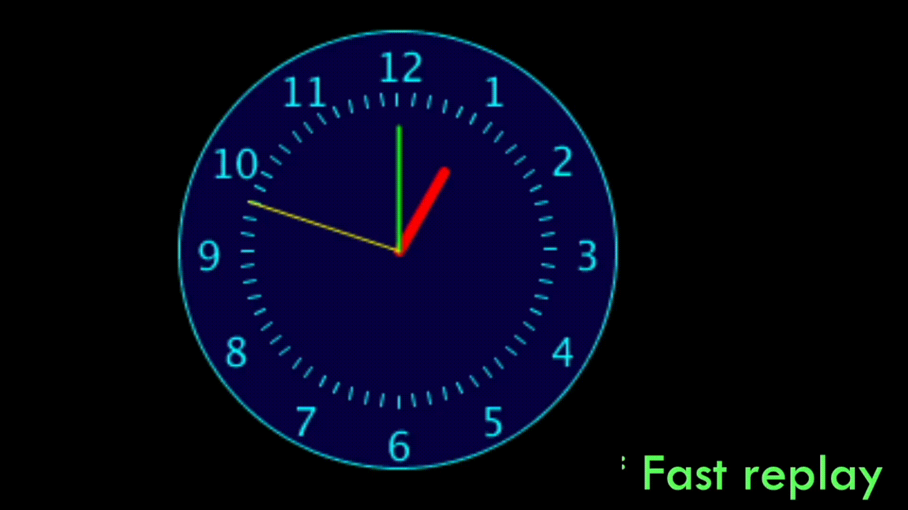

# Task 1 - Analogue Clock Version 3

Update your version 2 of the analogue clock code from Lecture Activity 5 to look similar to the given figure. 

[Download the starter code](./clock_starter/clock_starter.pde) then use loops to
  * Put all the numbers from 1 to 12
  * Put all the little minute ticks (dashes) around the clock. 

Follow the instructions in the starter code to finish your animation.

## Embed an animated gif of your drawing

Embed the animated gif you created here using markdown syntax:
