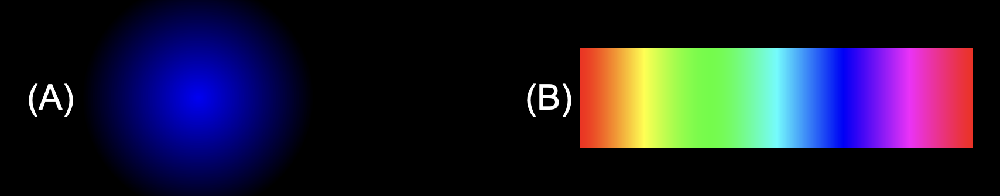
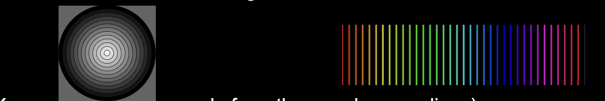

# Task 2 - while Loops

Write code that uses while loops to generate the following sketches.

*Hint:* above sketches can be produced by drawing many adjacent circles (for A) or lines (for B) while slightly changing the color. For example, the illustrations below are the same as the above except that the spacing between the circles/lines is larger.

## Embed a screenshot of your drawing

Embed the screenshot you added to the `screenshots` directory here using markdown syntax: