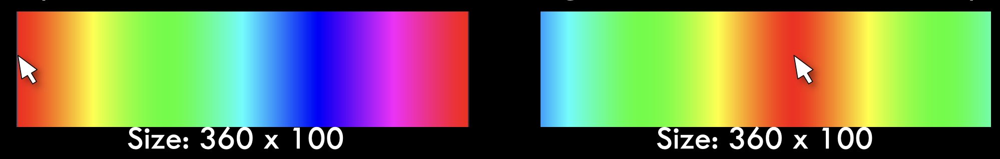
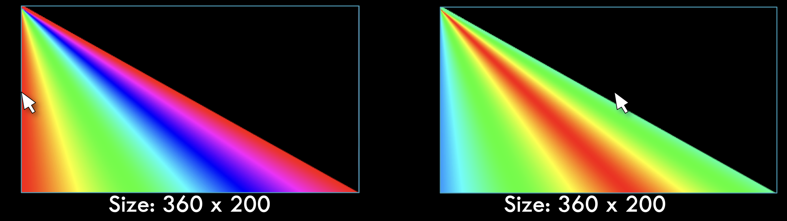

# Task 4 - Loops and User Interactivity

A) Write code to show all colors as in the example below – note that the red color follows the mouse (hint: use HSB, refer to last program in pre_class notes)

B) Change your above code so that the output is similar to below

## Embed an animated gif of your drawing

Embed the animated gif you created here using markdown syntax:

