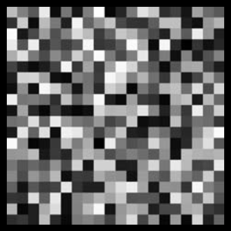
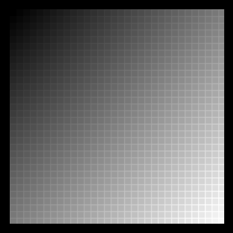

# Task 5 - Nested for Loops

A) Shiffman Exercise: 
  * Create a grid of squares, each colored randomly, using a for loop. 
  * Recode the same pattern using a while loop instead of for.
  

B) Generate the grid of squares in the lower figure. 
  * Note that each square is colored in a way that the window has a gradient shading.
each square has an outline that is slightly lighter in color than the fill color. 

## Embed a screenshot of your drawing

Embed the screenshot you added to the `screenshots` directory here using markdown syntax:
