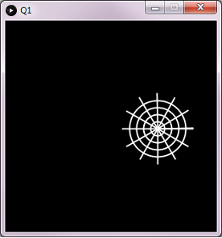

# Task 1: Bouncing Spider Web

In class, we created a simple animation of a bouncing ball. In this question, we will replace the ball with a spider-web-like shape similar to the one in the figure. You must use loops to draw the lines and circles.

## Specifications 

- We are expecting you to commit your work often (try to aim for a minimum of 3-5 commits per lab) with useful commit messages marking your progress.
- Draw many circles.
- Draw many lines.
- **Optional** Draw a colourful spider-web (different colors for circles and lines).

## Embed an animated gif of your drawing
 
Embed the animated gif you created here using markdown syntax: