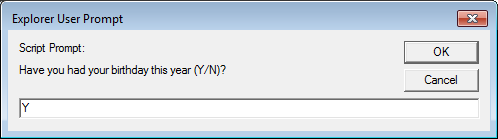
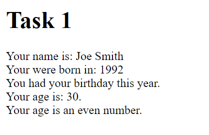
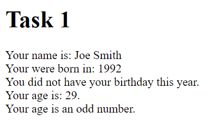

# Task 1 - Conditionals

In the previous lab, you learned how to make use of both string and numerical input through prompts.
However, in order to use input effectively, you need to adapt your program based on the input provided by the user. 

This is where conditionals come in.

## Task 1.1 - Using Conditionals

Here's what you need to do for this task:

- You will do everything for this task in the <a href="task1/task1.html">task1.html</a> file.

- Copy and paste the JavaScript code you wrote for task 2 of Lab06 into the `task1/task1.html` file. You will add into it for this lab. **Make sure you can reproduce the functionality from the previous lab locally and on GitHub Pages.**

- Ask the user if they already had their birthday this year with a pop-up prompt screen.

- Determine the age of the user based on the existing and new prompt.

- Determine if their age is even or odd (hint: you will need to use the remainder operator and an if-else statement).

## Task 1.2 - Conditionals and printing

Here's what you need to do for this task:

- Write into the HTML document the user's name, the year they were born, if they had a birthday this year, their age, and if their age is an even or odd number.

    - Result for Joe Smith, 1992, who had a birthday this year (answered 'Y')

    

    - Result for Joe Smith, 1992, who did not have birthday this year (answered 'N')

    

## Specifications

- Get user input as described in Task 1.1

- Determine the age from the user based on the input from the already existing and new prompt added from Task 1.1.

- Determine if the age of the user is even or odd as described in Task 1.1.

- Use a conditional expression to write on the document whether the user had their birthday already this year, depending on the user input (as outlined in Task 1.2)