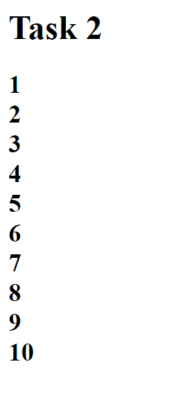
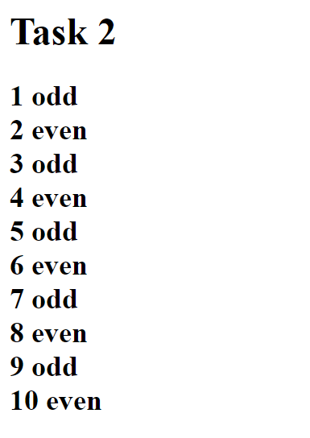

# Task 2 - Loops and Conditionals

Now that you have worked with conditionals on JavaScript, you will integrate conditionals with loops to create a simple counting program. 

## Loops

A loop allows us to repeat a set of statements as many times as we want. We have seen the `for` loop which has a general structure like this:

<pre>
for (<i>&lt;initialization&gt;</i>; <i>&lt;continuation&gt;</i>; <i>&lt;next iteration&gt;</i>)
{	<i>&lt;statement list&gt;</i>
}
</pre>

The "initialization" part is usually used to initialize a loop variable that will count the number of times the loop has been executed.

The "continuation" is a conditional test that determines if the loop should stop, usually based on the value of the loop variable.

The "next iteration" normally increments the loop variable by 1 but other increments or even decrements are possible.

The following is an example of a loop that prints the numbers from 0 to 9 in the HTML document:

<pre>
var i;
for (i=0; i < 10; i++){	
	document.write(i);
	document.write("&lt;br/&gt;");		// Line break after each number puts each number on a separate line
}
</pre>

## Task 2.1 - Using Loops

Here's what you need to do:

- You will do everything for this task in the <a href="task/task2.html">task2.html</a> file.

- Create a loop that initializes at 1 and runs 10 times (with the 10th time included).

- For each iteration, print the loop variable number into the document.

- Each number should be on separate line.

Here's what we are expecting of you:

## Task 2.2 - Using Conditionals

Here's what you need to do:

- Determines if the loop variable number is odd or even.

- The "even" or "odd" text should be on the same line as the number.

Here's what we are expecting of you:

## Specifications

- Create a loop as described in Task 1.1

- Create a conditional statement that determines whether the number is even or odd (as described in Task 2.2).

- Appropriately print the numbers and text into the document as described in Task 2.1 and Task 2.2