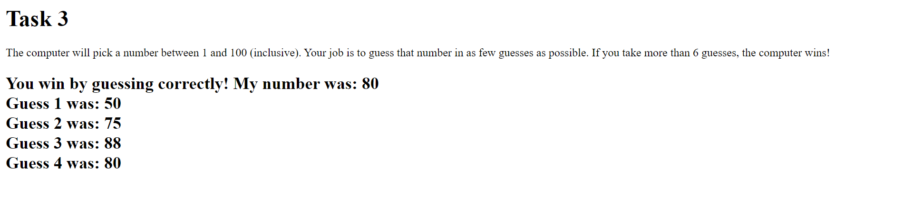
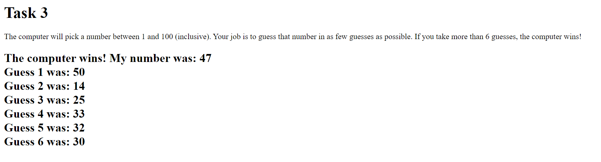

# Task 3 - Conditionals, Loops and Arrays

For this task, you will create a program where the computer will pick a random number, and the user will try to guess the random number with feedback from the computer.

You will do everything for this task in the <a href="task3/task3.html">task3.html</a> file.

There is already starter code on this file, as well as some helper comments. **You do not need to change the code already present in the file. You will add onto it.**

## Arrays

An array is a data structure that can store multiple objects.  An array has a size when it is created.  Unlike other variables, we must create an array using the `new` keyword and provide its size.  Each element in the array is accessed by providing the array name and an index that starts from 0 and goes up to the size of array - 1. The **index**, also called a subscript, is put in square brackets.

An example of declaring an array of size 5 and setting and retrieving values in array is below:

<pre>
var myArray = new Array(5);
var size = myArray.length;			// size will have value 5

myArray[0] = 4;
myArray[1] = 2;
myArray[2] = 1;
myArray[3] = myArray[2];			// myArray[3] now has value 1
myArray[4] = myArray[0]*myArray[1];		// myArray[4] now has value 8
</pre>

## Task 3.1 - Setting Things Up

Here's what you need to do for this task:

- Create an empty array of size 6.

- Generate and store a random value between 1 and 100 using the `getRandom()` function.

## Task 3.2 - User Input

Here's what you need to do for this task:

- Create a loop that runs 6 times. 

- For each iteration, ask the user to guess a number between 1 and 100 (hint: do not create the variable that stores the user's guess inside the loop).

- Store the user's guess into one of the array's indexes (hint: you will need to store the first guess in index 0, the second guess in index 1, and so on).

- Determine if the user's guess is too high or too low and send an alert based on each case (hint: a conditional statement was already created for when the user guessed right. You will add onto it).

## Task 3.3 - Writing Output

Here's what you need to do for this task:

- If the user has not guessed after 6 guesses, print a message stating that the computer won and the computer's number into the webpage.

- Print all the list of guesses from the user into the webpage, regardless of whether the user or the computer won.

## Final Output

Here's roughly what we are expecting of you:

- The user guessed correctly:

- The user did not manage to guess:

## Specifications 

- Get and store each guess.

- Create two alerts: one when the user guessed too high, one when they guessed too low. 

- If they have not guessed correctly, make the user guess 6 times.

- Print all the user's guesses into the webpage (regardless of whether they lost or not).
