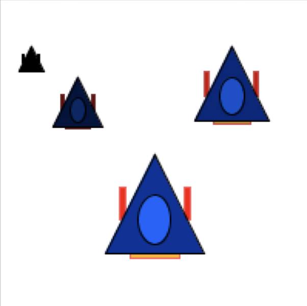

# Task 1 - Tint your Spaceship
```
void setup(){
 size(300,250);
}
void draw() {
 background(255);
 drawSpaceship(100,100,64);
 drawSpaceship(250,40,32);
 drawSpaceship(50,50,32);
 drawSpaceship(150,80,32);
 drawSpaceship(200,100,96);
}
void drawSpaceship(int x,int y,int size){
 ...
}
```
Modify drawSpaceship() function given before so that you can also control the brightness of the spaceship. For example, the following code should produce the output given below.
```
drawSpaceship(20,30,16,0);   //tiny spaceship
drawSpaceship(50,50,32,0.4);  //small spaceship
drawSpaceship(150,30,48,0.8); //medium spaceship
drawSpaceship(100,100,64,1.0); //big spaceship
```
  - E.g. brightness should be given as a number in the range of 0..1:
      0 means extremely dark (black silhouette), 1 means normal colors

*Hint:* multiply the brightness value by every color component in your function, e.g. fill(255) should be changed to fill(255*brightness).



## Embed a screenshot of your drawing

Embed the screenshot of your drawing (not the code) here using markdown syntax: