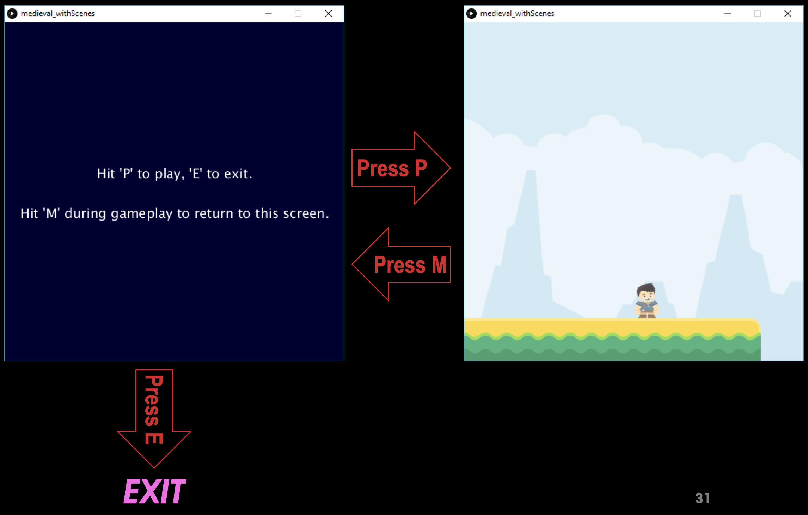

# Task 3 - Update your Game

* Download the [starter code](medieval_withScenes) and unzip to your computer.
* Open any of the three files in Processing. 
  - You will notice all three files appear in 3 tabs.  
* Run the code (Ctrl+R) and observe the output.
  - This is the same “Player Jumping” exercise we did before.  
* Implement the following two requirements 
  - REQ1 : go to scene1 tab and use functions to organize your code (see the REQ comments in scene1).
  - REQ2: add one more scene, named scene0, in a new tab (press the triangle button beside scene1 tab to create a new tab). The new scene should be the game’s opening screen with the message “Hit ‘P’ to play, and ‘E’ to exit. Hit ‘M’ during gameplay to return to this screen”. You will need to update the keyReleased function with the following:
    * if(we are in scene 0 and player hits P) then go to scene 1
    * if(we are in scene 0 and player hits E) then exit()
    * if(we are in scene 1 and player hits M) then go to scene 0

## Embed an animated gif of your drawing
 
Embed the animated gif you created here using markdown syntax: