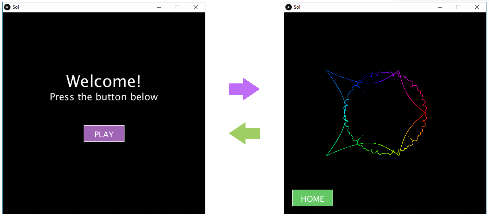

# Task 1: Scene Switching

In class, we created a simple multi-scene animation where the user can go from one scene to the other by pressing certain keys on the keyboard. In this assignment, you will repeat this exercise again but with the following differences:

- Switching scenes is done by clicking a button on the sketch in each scene. That is, clicking the PLAY button on the home screen takes you to the second scene, and clicking the HOME button in the second scene takes you back to the home screen (see the figure below). Hint: we have seen how to do this in the “Conditionals” lecture.

- The second scene (on the right figure below) should include any other complex animation you've done in the past, for example the spider web from Lab 9, or the super shape. It can also include any other complex animation if you wish (make sure it works, and you clearly indicate in the comments which animation you used).

## Specifications

- We are expecting you to commit your work often (try to aim for a minimum of 3-5 commits per lab) with useful commit messages marking your progress.
- Choosing to draw either the first or the second scene in the draw() method.
- Completing the home screen (on the left above).
- Completing the second scene (on the right above).
- Handling mouse clicks on the PLAY and HOME buttons.
- **Optional** Add one more scene and two buttons per scene that allow switching from one scene to any of the other two; e.g. for scene1 on the right in the above figure, you should one extra button that takes you to a third scene.

## Embed an animated gif of your drawing
 
Embed the animated gif you created here using markdown syntax: